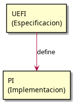
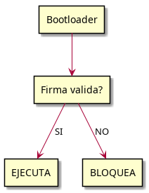

# TP3a: UEFI y Platform Initialization

## 📖 Contenido

Aquí encontrarás una **explicación completa desde cero** sobre UEFI y cómo funciona el arranque de una computadora moderna.

### 📚 Documentos

- **[UEFI_Explicacion.md](UEFI_Explicacion.md)** - Guía completa con explicaciones detalladas
  
  Contiene:
  - ¿Qué es UEFI? (vs BIOS antiguo)
  - Las 5 fases de arranque (SEC, PEI, DXE, BDS, RT)
  - Estructuras de datos (System Table)
  - Protocolos y Handles
  - Driver Model (Lazy Loading)
  - Seguridad (Secure Boot, S3 Resume Attack)

---

## 📊 Diagramas Visuales

Los diagramas están en la carpeta `diagramas/` en formato PNG:

### 1. UEFI vs PI

**Diferencia:** UEFI es la especificación, PI es la implementación

### 2. Las 5 Fases de Arranque

**Flujo:** SEC → PEI → DXE → BDS → Sistema Operativo

### 3. UEFI System Table

**Estructura:** Boot Services y Runtime Services

### 4. Handles y Protocols

**Concepto:** Identificadores únicos (GUIDs) para descubrir hardware

### 5. Lazy Loading (DXE)

**Ventaja:** Solo conecta drivers cuando se necesitan (arranque rápido)

### 6. Secure Boot

**Protección:** Verifica firmas criptográficas de bootloaders

### 7. Flujo Completo

**Resumen:** Todo el proceso de encendido a Runtime Services

---

## 🎯 Objetivos de Aprendizaje

Al leer esta documentación, entenderás:

1. ✅ La diferencia entre UEFI (especificación) y PI (implementación)
2. ✅ Cómo arrancan las computadoras modernas (5 fases)
3. ✅ Cómo se cargan los drivers en orden correcto
4. ✅ Las estructuras de datos principales de UEFI
5. ✅ Cómo se comunican los programas con el hardware
6. ✅ Los riesgos de seguridad y cómo se mitigan

---

## 🔗 Recursos Adicionales

Para profundizar:
- [UEFI Specification](https://uefi.org/specifications) (oficial)
- [Pi Specification](https://github.com/tianocore/edk2-IntelFrameworkModulePkg) (TianoCore)

---

**Última actualización:** Mayo 2026
