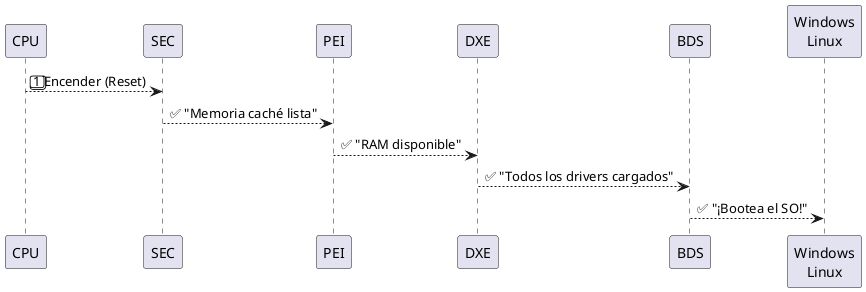
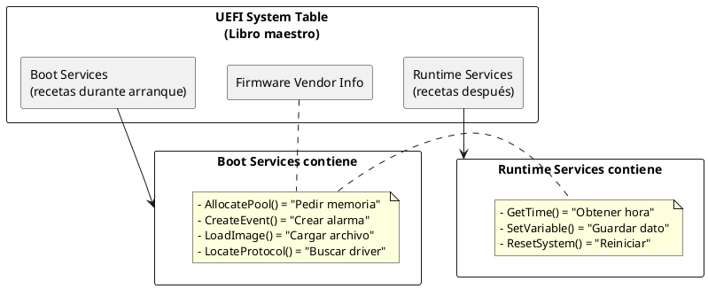
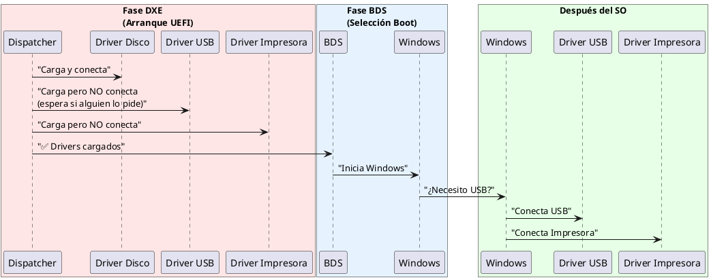
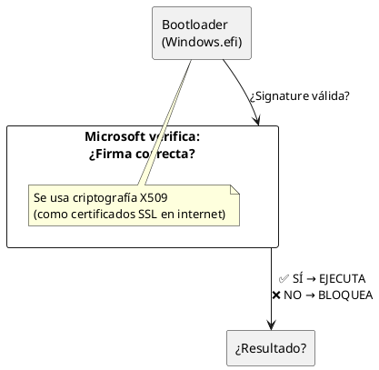
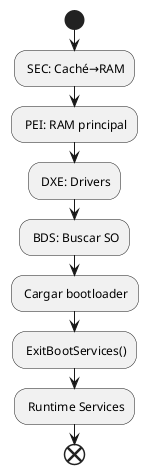

# UEFI y Platform Initialization (PI) - Guía Completa Desde Cero

## 📚 Introducción: ¿Qué es UEFI?

### El Problema Antiguo: BIOS

Imagina que hace 40 años crearon una interfaz llamada **BIOS** (Basic Input/Output System) para que la computadora pudiera **arrancar desde cero**:

```
┌─────────────────────────────────────────────────────────┐
│ BIOS (1981)                                              │
├─────────────────────────────────────────────────────────┤
│ ❌ Limitado a 16 bits (código muy viejo)                │
│ ❌ Solo 1 MB de memoria disponible                       │
│ ❌ Hardware muerto (timer 8254, controlador 8259)        │
│ ❌ Lento (tarda mucho en arrancar)                       │
│ ❌ No modular (todo mezclado)                            │
│ ❌ Difícil de actualizar (riesgoso)                      │
└─────────────────────────────────────────────────────────┘
```

### La Solución Moderna: UEFI

En 1998, Intel creó **UEFI** (Unified Extensible Firmware Interface):

```
┌─────────────────────────────────────────────────────────┐
│ UEFI (1998 - Hoy)                                        │
├─────────────────────────────────────────────────────────┤
│ ✅ Moderno (soporta 32 y 64 bits)                        │
│ ✅ Acceso a toda la memoria                              │
│ ✅ Hardware moderno (USB, SATA, NVME)                    │
│ ✅ Rápido (modular, solo carga lo necesario)             │
│ ✅ Seguro (Secure Boot, firmas digitales)                │
│ ✅ Extensible (se puede actualizar fácilmente)           │
│ ✅ Compatible con sistemas antiguos y nuevos             │
└─────────────────────────────────────────────────────────┘
```

---

## 🎯 Concepto Clave #1: UEFI vs PI

### ¿Cuál es la diferencia?

```plantuml
@startuml
!define ACCENT #FF6B6B

rectangle "UEFI" as UEFI {
    note right
    UEFI = ESPECIFICACIÓN
    
    ¿QUÉ? Define LAS REGLAS
    
    - "Las APIs deben funcionar así"
    - "Los drivers deben usar esta interfaz"
    - "Los bootloaders hablan este idioma"
    
    Es como el MANUAL de instrucciones
    end note
}

rectangle "PI (Platform Init)" as PI {
    note right
    PI = IMPLEMENTACIÓN INTERNA
    
    ¿CÓMO? Define CÓMO CONSTRUIR
    
    - "El hardware se inicializa en 5 fases"
    - "Los drivers se cargan en este orden"
    - "La memoria se gestiona así"
    
    Es el CONSTRUCCIÓN detrás del manual
    end note
}

UEFI --> PI : "usa las reglas de"
@enduml
```

**En analogía simple:**
- **UEFI** = Las reglas de un juego (cómo hablan todos)
- **PI** = Las herramientas internas para construir el juego

---

## 🔄 Concepto Clave #2: Las 5 Fases de Arranque (PI)

Cuando enciendes tu computadora, sucede esto:



### Fase 1: SEC (Security)

**Momento:** Acabas de apretar el botón de encendido

```
┌──────────────────────────────────────────┐
│ SEC: Seguridad (primeros 10ms)            │
├──────────────────────────────────────────┤
│ Estado: NO hay RAM todavía                │
│ CPU: Está sola, sin memoria               │
│                                           │
│ ¿QUÉ HACE?                                │
│ 1. Activa la CACHÉ del CPU               │
│    (la convierte en RAM temporal)         │
│ 2. Establece la "raíz de confianza"       │
│    (verifica que el firmware no fue       │
│     modificado por hackers)               │
│ 3. Prepara el ambiente mínimo             │
│                                           │
│ RESULTADO: ✅ RAM de caché disponible     │
└──────────────────────────────────────────┘
```

**Analógía:** Como encender un teléfono. Al principio, solo hay batería y el procesador. SEC es lo primero que se ejecuta.

---

### Fase 2: PEI (Pre-EFI Initialization)

**Momento:** Primeros segundos de arranque

```
┌──────────────────────────────────────────────────────┐
│ PEI: Pre-inicialización (~1-2 segundos)               │
├──────────────────────────────────────────────────────┤
│ Estado: RAM caché funciona, pero RAM principal NO    │
│ Objetivo: "Inicializar lo MÍNIMO para continuar"      │
│                                                       │
│ ¿QUÉ HACE?                                            │
│ 1. ENCIENDE la RAM principal                         │
│    (controlador de memoria, voltajes, etc.)          │
│ 2. Inicializa el CHIPSET básico                      │
│    (para comunicarse con el resto del hardware)       │
│ 3. Detecta el MODO DE ARRANQUE                       │
│    - ¿Es un encendido normal?                        │
│    - ¿Reanudar desde suspensión (S3)?                │
│    - ¿Modo de recuperación?                          │
│ 4. RECOPILA información → HOBs                       │
│    (Hand-Off Blocks = "notas" que pasa a PEI)        │
│                                                       │
│ RESULTADO: ✅ RAM principal disponible, info lista   │
└──────────────────────────────────────────────────────┘
```

**Analógía:** Como conectar una batería grande a un teléfono. PEI enciende los componentes críticos.

**¿Qué son los HOBs?**
Son como "notas post-it" que PEI deja para DXE:
```
HOB #1: "Encontré 8GB de RAM"
HOB #2: "CPU es modelo XYZ"
HOB #3: "Modo de arranque: Normal"
HOB #4: "Batería al 100%"
```

---

### Fase 3: DXE (Driver Execution Environment)

**Momento:** Segundos 2-10 de arranque

```
┌───────────────────────────────────────────────────────┐
│ DXE: Entorno de Drivers (~5-8 segundos)                │
├───────────────────────────────────────────────────────┤
│ Estado: RAM funciona, hardware inicializado            │
│ Objetivo: "Cargar todos los drivers necesarios"        │
│                                                        │
│ ¿QUÉ HACE?                                             │
│ 1. DXE Dispatcher (controlador automático)             │
│    Carga drivers en el ORDEN correcto                 │
│    (respetando dependencias)                           │
│                                                        │
│ Ejemplo de orden:                                      │
│    1️⃣ Driver de Chipset                               │
│    2️⃣ Driver de PCI (para buses)                      │
│    3️⃣ Driver de SATA (disco duro)                     │
│    4️⃣ Driver de Teclado                               │
│    5️⃣ Driver de GPU (pantalla)                        │
│                                                        │
│ 2. Instala SERVICIOS de UEFI                          │
│    - Boot Services (para manipular memoria)            │
│    - Runtime Services (para después de arrancar)       │
│                                                        │
│ 3. Cada driver crea un PROTOCOLO                      │
│    (una forma de que otras cosas interactúen)          │
│                                                        │
│ RESULTADO: ✅ Hardware funcional, UEFI lista          │
└───────────────────────────────────────────────────────┘
```

**Analógía:** Como instalar aplicaciones en un teléfono. DXE instala todos los "drivers" (aplicaciones de bajo nivel).

---

### Fase 4: BDS (Boot Device Selection)

**Momento:** Segundos 10-15 de arranque

```
┌───────────────────────────────────────────────────────┐
│ BDS: Selección de Dispositivo de Arranque              │
├───────────────────────────────────────────────────────┤
│ Estado: TODO funciona, hardware listo                  │
│ Objetivo: "¿De dónde cargo el Sistema Operativo?"      │
│                                                        │
│ ¿QUÉ HACE?                                             │
│ 1. Lee NVRAM (memoria no volátil)                     │
│    Busca variables guardadas tipo:                     │
│    - "BootOrder=[1,2,3]"                              │
│    - "Boot0001=Windows en SATA0"                      │
│                                                        │
│ 2. Según el orden, busca DISPOSITIVOS                 │
│    "Intenta arrancar de disco primero,                │
│     luego USB, luego red"                             │
│                                                        │
│ 3. CONECTA CONSOLAS (entrada/salida)                 │
│    - Teclado (entrada)                                │
│    - Pantalla (salida)                                │
│    - Así puedes ver y controlar el arranque           │
│                                                        │
│ 4. Carga el BOOTLOADER del SO                         │
│    - Windows: bootmgr.efi                             │
│    - Linux: GRUB.efi                                  │
│                                                        │
│ RESULTADO: ✅ Windows/Linux comienzan a cargar        │
└───────────────────────────────────────────────────────┘
```

**Analógía:** Como elegir qué app abrir al iniciar el teléfono.

---

### Fase 5: RT (Runtime)

**Momento:** Después de que Windows/Linux se carga

```
┌───────────────────────────────────────────────────────┐
│ RT: Runtime (cuando el SO está corriendo)               │
├───────────────────────────────────────────────────────┤
│ Estado: Windows/Linux está en control                  │
│ Objetivo: "Proporcionar servicios básicos al SO"        │
│                                                        │
│ ¿QUÉ HACE?                                             │
│ 1. El bootloader llama a ExitBootServices()            │
│    (Esto finaliza el pre-arranque)                     │
│                                                        │
│ 2. Libera CASI toda la memoria                         │
│    (el SO necesita espacio)                            │
│                                                        │
│ 3. MANTIENE Runtime Services activos:                 │
│    - GetTime() → Obtener hora                         │
│    - SetVariable() → Guardar variables                │
│    - ResetSystem() → Reiniciar                        │
│                                                        │
│ 4. El SO puede llamar a estos servicios               │
│    incluso después del arranque                        │
│                                                        │
│ RESULTADO: ✅ Windows/Linux funciona normalmente       │
└───────────────────────────────────────────────────────┘
```

**Analógía:** Como un servicio técnico que sigue disponible después de comprar el teléfono.

---

## 🏗️ Concepto Clave #3: Estructuras de Datos (UEFI System Table)

Imagina que UEFI es un **libro de recetas**:



**En código UEFI típico:**
```c
// Acceder a System Table
EFI_STATUS Status = SystemTable->ConOut->OutputString(
    SystemTable->ConOut,
    L"Hola Mundo\n"  // Escribe en pantalla
);
```

---

## 🎮 Concepto Clave #4: Protocolos y Handles

### ¿Qué es un Protocolo?

Un **Protocolo** es como un "contrato" que dice:
- "Yo soy un driver de disco duro"
- "Mis funciones son: Read(), Write(), Flush()"
- "Cualquiera que necesite leer disco, úsame"

### ¿Qué es un Handle?

Un **Handle** es como una "dirección":
- Handle #1 = "Driver de disco SATA0"
- Handle #2 = "Driver de teclado USB"
- Handle #3 = "Driver de red Ethernet"

### Juntos: Base de Datos de Handles

```plantuml
@startuml
rectangle "Sistema UEFI" {
    rectangle "Handle #1" {
        note right
        BlockIo Protocol
        - Read()
        - Write()
        end note
    }
    rectangle "Handle #2" {
        note right
        SimpleInput Protocol
        - ReadKeyStroke()
        end note
    }
    rectangle "Handle #3" {
        note right
        SimpleText Output Protocol
        - OutputString()
        end note
    }
}

note right of "Sistema UEFI"
Todo es descubrible mediante GUIDs
GUID = Identificador único global
example: 0x00000001-0x0002-0x0003...
end note
@enduml
```

**Cómo se usa:**
```c
// Buscar protocolo de disco
EFI_BLOCK_IO_PROTOCOL *BlockIo;
gBS->LocateProtocol(&gEfiBlockIoProtocolGuid, NULL, &BlockIo);

// Ahora puedo leer disco
BlockIo->ReadBlocks(BlockIo, 0, 512, buffer);
```

---

## 🔐 Concepto Clave #5: UEFI Driver Model (Lazy Loading)

### El Problema Antiguo

```
Enciendes PC → Todos los drivers SE ENCIENDEN
                (teclado, red, impresora, scanner, etc)
                ❌ Muy lento (2-3 minutos!)
```

### La Solución UEFI Moderna

```
Enciendes PC → Solo se encienden drivers NECESARIOS
                (disco, pantalla, teclado)
                → Se encuentra el SO
                → SO enciende lo demás después
                ✅ Mucho más rápido (10 segundos!)
```



---

## 🛡️ Concepto Clave #6: Seguridad en UEFI

### Secure Boot (Arranque Seguro)

```
¿El problema?
Alguien hackea tu firmware o bootloader
→ Tu computadora se infecta PERMANENTEMENTE
   (incluso formateando Windows)

¿La solución?
UEFI verifica FIRMAS antes de ejecutar:

1. CPU despierta
2. Lee firma del firmware → ¿Es original?
3. Lee firma del bootloader → ¿Está firmado?
4. Si NO está firmado → ¡NO EJECUTES!
   (solo si presionas Ctrl+Alt+Delete)
```



### El Riesgo: S3 Resume Attack

```
Problema moderno:

Para hacer boot rápido (S3 Resume):
- Firmware guarda un "script" de comandos
  (tipo: "Escribir en registro XYZ")

Atacante:
1. Inyecta comandos maliciosos en el script
2. Al reanudar desde suspensión, se ejecutan
3. ¡Código malicioso en firmware!

Resultado:
- Persiste incluso formateando Windows
- Acceso total (raíz/admin)
- Muy difícil de detectar
```

---

## 📊 Diagrama Completo: Flujo de Arranque Total



---

## ✅ Resumen en una Tabla

| Concepto | Explicación Simple |
| :--- | :--- |
| **UEFI** | Las reglas/especificación |
| **PI** | La implementación interna |
| **SEC** | Enciende caché como RAM |
| **PEI** | Enciende RAM principal |
| **DXE** | Carga todos los drivers |
| **BDS** | Elige de dónde arrancar |
| **RT** | Servicios disponibles después |
| **Protocolo** | "Contrato" de funcionalidad |
| **Handle** | "Dirección" de un driver |
| **Secure Boot** | Verifica firmas digitales |
| **S3 Resume** | Arranque rápido (desde suspensión) |

---

## 🎓 Ejercicio: Dibuja tu Propia Computadora

Intenta dibujar un diagrama similar con **tu propia computadora**:

1. ¿Cuántos segundos tarda en llegar a Windows?
2. Divide ese tiempo en 5 partes (SEC, PEI, DXE, BDS, RT)
3. ¿Cuántos drivers crees que se cargan?
4. ¿Cuál crees que es el más importante?

---

¿Necesitas que profundice en algún tema específico?
