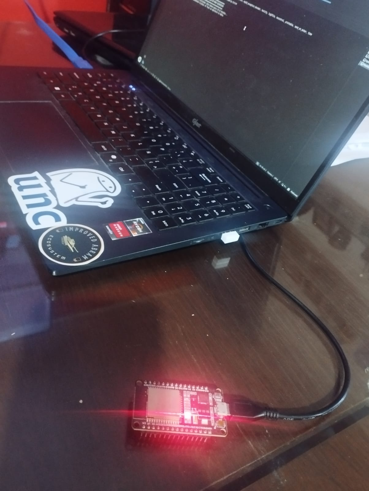
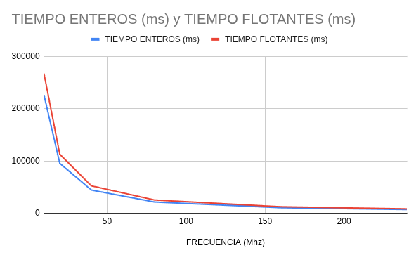

# Análisis de Performance del ESP32 bajo Variación de Frecuencia de CPU

Este documento presenta los resultados experimentales obtenidos al ejecutar un *benchmark* sintético automatizado en un microcontrolador ESP32 (Dev Module). El objetivo es caracterizar el impacto que tiene la modificación de la frecuencia de reloj del CPU (`setCpuFrequencyMhz()`) sobre el tiempo de ejecución de operaciones aritméticas básicas utilizando tipos de datos Enteros (`int`) y de Punto Flotante (`float`).

-----

El experimento demuestra empíricamente que **el tiempo de ejecución de un programa es inversamente proporcional a la frecuencia del reloj de la CPU**. Al reducir la frecuencia a la mitad (ej. de 160 MHz a 80 MHz), el tiempo físico que tarda el procesador en completar la misma cantidad de instrucciones se duplica de manera proporcional, confirmando la relación lineal entre ciclos de reloj por segundo y el tiempo de proceso. Además, se verificó una brecha de rendimiento constante donde las operaciones con `float` son sistemáticamente más lentas que las de `int` debido a la mayor complejidad arquitectónica de la aritmética de punto flotante.

-----

## 1\. Metodología Experimental

### Hardware y Entorno de Desarrollo

  * **Microcontrolador:** ESP32 
  * **Entorno de Desarrollo:** Visual Studio Code con extensión PlatformIO. Framework Arduino (`arduino`).  

  


### Procedimiento del Test

Se diseñó un código modular que ejecuta secuencialmente una "batería de pruebas" para las siguientes frecuencias de CPU permitidas por el fabricante: `240`, `160`, `80`, `40`, `20` y `10` MHz.

Cada prueba consiste en:

1.  **Configuración:** Establecer la frecuencia deseada (`setCpuFrequencyMhz()`).
2.  **Benchmark de Enteros (`int`):** Un bucle `for` de $150 \times 10^6$ iteraciones que realiza una suma acumulativa utilizando una variable de tipo `volatile int`. La palabra clave `volatile` es crítica para evitar que el compilador optimice (borre) el bucle al detectar que el resultado no se utiliza.
3.  **Benchmark de Flotantes (`float`):** Un bucle `for` idéntico de $150 \times 10^6$ iteraciones utilizando una variable `volatile float` y sumando un valor decimal (`+1.5`).
4.  **Medición:** Se utiliza la función `millis()` por hardware para registrar el tiempo inicial y final de cada bucle, calculando la diferencia en milisegundos.

*Nota de optimización:* Para asegurar la integridad de la comunicación a frecuencias muy bajas, los datos no se imprimieron en tiempo real, sino que se almacenaron en una matriz de memoria y se imprimieron en una tabla final una vez que el procesador restauró su velocidad máxima (240 MHz). Todo esto para visualizar resutados enterminal. Si no habria que cambiar la frecuencia del monitor serial a cada rato.

-----

---
```cpp
#include <Arduino.h>

void setup() {
  Serial.begin(115200);
  delay(3000); 

  // Las frecuencias que vamos a probar
  int frecuencias[] = {240, 160, 80, 40, 20, 10};
  int cantidadDePruebas = 6;
  
  // Arreglos (memoria) para guardar los tiempos de cada prueba
  unsigned long tiemposInt[6];
  unsigned long tiemposFloat[6];

  Serial.println("\n==================================================");
  Serial.println("🚀 INICIANDO BATERIA DE PRUEBAS EN MODO SILENCIOSO");
  Serial.println("==================================================");
  Serial.println("El ESP32 esta calculando. Esto tomara aprox 10-15 minutos...");
  Serial.println("No desconectes la placa. Al final se imprimira la tabla.");


  for (int i = 0; i < cantidadDePruebas; i++) {
    setCpuFrequencyMhz(frecuencias[i]); // Cambiamos la velocidad
    
    // Prueba de Enteros 
    unsigned long inicioInt = millis();
    volatile int sumaInt = 0; 
    for(long j = 0; j < 150000000; j++) { 
      sumaInt += 1; 
    }
    tiemposInt[i] = millis() - inicioInt; // Guardamos el tiempo en la memoria

    //  Prueba de Flotantes 
    unsigned long inicioFloat = millis();
    volatile float sumaFloat = 0.0;
    for(long j = 0; j < 150000000; j++) { 
      sumaFloat += 1.5; 
    }
    tiemposFloat[i] = millis() - inicioFloat; // Guardamos el tiempo en la memoria
  }

  // RESTAURAMOS LA VELOCIDAD 
  setCpuFrequencyMhz(240); 
  delay(100); 
  
  // Imprimimos la tabla con todos los resultados guardados
  Serial.println("\n\n✅ ¡PRUEBAS FINALIZADAS! Aqui tienes tus datos:");
  Serial.println("==================================================");
  Serial.println("FRECUENCIA | TIEMPO INT (ms) | TIEMPO FLOAT (ms)");
  Serial.println("--------------------------------------------------");
  
  for (int i = 0; i < cantidadDePruebas; i++) {
    Serial.printf("%3d MHz    | %15lu | %17lu\n", frecuencias[i], tiemposInt[i], tiemposFloat[i]);
  }
  Serial.println("==================================================");
}

void loop() {
}


```
---

## 2\. Resultados Obtenidos


| Frecuencia del CPU | Tiempo Enteros (ms) | Tiempo Flotantes (ms) |
| :--- | :--- | :--- |
| **240 MHz** | 6.926 | 8.186 |
| **160 MHz** | 10.429 | 12.325 |
| **80 MHz** | 21.347 | 25.227 |
| **40 MHz** | 44.234 | 52.283 |
| **20 MHz** | 95.390 | 112.748 |
| **10 MHz** | 226.074 | 267.189 |

-----

### 2.1 Gráfico de Puntos 



#### *Rendimiento del ESP32: Tiempo vs. Frecuencia de CPU*

  * **Observación:** Se nota una curva asintótica pronunciada. A frecuencias altas, los tiempos son bajos y cercanos entre sí, pero a medida que la frecuencia baja de 40 MHz, el tiempo de ejecución se dispara drásticamente hacia arriba. La línea roja (`float`) se mantiene consistentemente por encima de la azul (`int`).

-----


## 3\. Análisis de Resultados

### ¿Qué sucede con el tiempo del programa al duplicar (variar) la frecuencia?

Al analizar la tabla de datos y los gráficos, la conclusión técnica es contundente:

> **Existe una relación de proporcionalidad inversa entre la Frecuencia del CPU y el Tiempo de Ejecución.**

Matemáticamente se expresa como: $$Tiempo \propto \frac{1}{Frecuencia}$$

Esto significa que:

  * **Al dividir la frecuencia por 2, el tiempo se duplica:** Si observamos la transición de **80 MHz** (Tiempo Int: 21.3 s) a **40 MHz** (Tiempo Int: 44.2 s), vemos que la frecuencia bajó a la mitad y el tiempo prácticamente se duplicó ($21.3 \times 2 = 42.6 \approx 44.2$). El ligero desvío se debe a *overheads* internos del sistema operativo que se vuelven más notorios a baja velocidad.
  * **Al multiplicar la frecuencia por 2, el tiempo se reduce a la mitad:** Si pasáramos de 40 MHz a 80 MHz, el tiempo bajaría de \~44 s a \~21 s.

El procesador del ESP32 ejecuta una cantidad fija de instrucciones por ciclo de reloj (IPC, *Instructions Per Cycle*). Al haber fijado el número de instrucciones ($150 \times 10^6$ iteraciones), si reducimos la cantidad de ciclos que ocurren por segundo (la frecuencia), el procesador tardará más segundos físicos en acumular la cantidad de ciclos necesarios para terminar el trabajo.


-----

