# TP3 - 3.a

# TEORICO: 

# Interfaz de Firmware Extensible Unificada (UEFI) 

## 📖 Marco Teórico

### ¿Qué es UEFI y por qué reemplaza a BIOS?

El BIOS antiguo tenía limitaciones serias: era código de **16 bits**, solo accedía a **1 MB de memoria**, y dependía de hardware heredado de los años 80 (como chips timer 8254 y controladores de interrupciones 8259). Era lento y difícil de actualizar.

**UEFI** (Unified Extensible Firmware Interface) llegó para reemplazarlo. Es una interfaz moderna que soporta **32 y 64 bits**, accede a toda la memoria, y funciona con hardware actual (USB, SATA, NVMe, etc.). Lo importante: **UEFI es la especificación** (las reglas de cómo debe funcionar).

Pero hay un concepto diferente:

#### UEFI vs PI: ¿Cuál es la diferencia?


- **UEFI**: Son las APIs, la interfaz que usa el sistema operativo. Es lo que ves, el "contrato" que el firmware promete cumplir.
- **PI (Platform Initialization)**: Es la **arquitectura interna** del firmware. Define cómo se construye todo desde que enciendes la PC hasta que carga Windows.

### Las 5 Fases: Cómo Arranca tu Computadora

Cuando enciendes tu PC. El firmware ejecuta **5 fases en orden**:

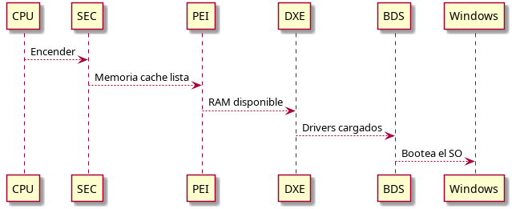

1. **SEC (Security)** - El primer segundo
   - El CPU no tiene acceso a RAM todavía
   - Se usa la **caché del CPU como RAM temporal** (Cache-as-RAM)
   - Se establece la "raíz de confianza" (base de toda la seguridad)

2. **PEI (Pre-EFI Initialization)** - 1-2 segundos
   - Se inicializa la RAM principal
   - Se detectan componentes críticos (controlador de memoria, chipset)
   - Se genera información que se pasa a la siguiente fase

3. **DXE (Driver Execution Environment)** - 5-8 segundos
   - Es la **fase más importante**. Se cargan todos los drivers
   - Cada driver se carga en el orden correcto (uno depende del otro)
   - Se crean abstracciones para USB, disco, pantalla, etc.

4. **BDS (Boot Device Selection)** - 1-2 segundos
   - Se decide **cuál sistema operativo cargar**
   - Se conectan periféricos (teclado, pantalla)
   - Se transfiere control al bootloader de Windows o Linux

5. **RT (Runtime)** - Después que carga el SO
   - El bootloader del SO llama a `ExitBootServices()`
   - Ya no hay acceso a firmware, pero quedan **Runtime Services** disponibles
   - El SO usa esos servicios para cosas como obtener la hora o reiniciar

### Las Estructuras de Datos: Cómo se Comunica Todo

El firmware necesita un **directorio** para que todos encuentren dónde ir.

#### 1. UEFI System Table

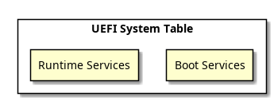

Es la **guía maestra**. Contiene dos cosas principales:

- **Boot Services**: Funciones disponibles **solo durante el arranque**
  - Pedir memoria (AllocatePool)
  - Crear alarmas/eventos (CreateEvent)
  - Cargar archivos (LoadImage)
  - Buscar drivers (LocateProtocol)

- **Runtime Services**: Funciones disponibles **antes y después** que carga el SO
  - Obtener la hora (GetTime)
  - Guardar variables de configuración (SetVariable)
  - Reiniciar la PC (ResetSystem)

#### 2. Handles y Protocolos: Cómo Descubrir Hardware


El firmware **abstrae todo como si fuera objetos**:

- **Handle**: Un identificador para **cualquier cosa** (un disco, un puerto USB, una impresora conectada)
- **Protocolo**: Las **funciones disponibles** de ese Handle
  - Ejemplo: BlockIo Protocol = leer/escribir un disco
  - Ejemplo: SimpleInput Protocol = leer del teclado

**¿Cómo funciona?** Tu programa busca un protocolo mediante un **GUID** (un número único global). Si existe, puedes usar sus funciones.

### El Truco Inteligente: Lazy Loading

Los drivers son listos: no hacen trabajo innecesario.


- **Se cargan todos los drivers** en la fase DXE
- **Pero solo se "conectan" si se necesitan**
  - El driver USB se carga pero no se inicializa si no hay nada enchufado
  - El driver de la impresora se carga pero la impresora no se enciende
- **Durante BDS**, el firmware solo **enciende lo que necesita** para encontrar el boot device (por ejemplo, el disco con Windows)
- El **resto de dispositivos se activan después**, a nivel del SO

**Resultado**: El arranque es **muy rápido** porque no esperamos a que se detecten todos los periféricos innecesarios.

### Seguridad: ¿Cómo Evitar que te Hackeen el Firmware?


El firmware verifica que el bootloader es legítimo:

1. Toma el archivo `.efi` (el bootloader de Windows)
2. Verifica su **firma digital** (como un certificado SSL)
3. Si la firma es válida → ejecuta
4. Si la firma es inválida o no está → bloquea

**Pero hay un riesgo importante:** El flujo **S3 Resume** (despertar de standby)

- En lugar de repetir las fases PEI y DXE (lento), guarda un "script" que reproduce las mismas operaciones
- Si un atacante modifica ese script, **puede ejecutar código malicioso muy temprano**
- Y el SO nunca se entera

Por eso: **la seguridad del firmware es crítica**.

### El Flujo Completo: De Cero a Windows

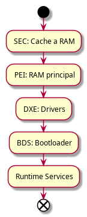


# PRACTICO:

## 3.1 Objetivo general

Comprender la arquitectura de la Interfaz de Firmware Extensible Unificada (UEFI) como un entorno pre-sistema operativo, desarrollar binarios nativos, entender su formato y ejecutar rutinas tanto en entornos emulados como en hardware físico (bare metal).

## Requisitos

Para realizar este trabajo es necesario contar con las siguientes herramientas instaladas:

- `QEMU`: emulador de arquitecturas de hardware y virtualización.
- `OVMF`: firmware UEFI para QEMU que reemplaza el BIOS legacy.
- `GNU-EFI`: entorno de desarrollo cruzado para compilar binarios EFI con `gcc`.
- `GHIDRA`: herramienta de ingeniería inversa para analizar y decompilar binarios UEFI.

## 1. Preparación del entorno

1. Crear el directorio de trabajo:

```bash
mkdir -p ~/uefi_security_lab && cd ~/uefi_security_lab
```

2. Instalar las dependencias base:

```bash
sudo apt install -y qemu-system-x86 ovmf gnu-efi build-essential binutils-mingw-w64
```

3. Instalar GHIDRA (por APT o Snap):

```bash
sudo apt install -y ghidra || sudo snap install ghidra --classic
```


#  TP1 - Exploración del Entorno UEFI y Shell


# Paso 2.1: Arrancar en QEMU con UEFI

Para iniciar un entorno UEFI con QEMU:

```bash
qemu-system-x86_64 -m 512 -bios /usr/share/ovmf/OVMF.fd -net none
```

| Parámetro | Qué hace |
|-----------|----------|
| `qemu-system-x86_64` | Emula una PC x86 de 64 bits |
| `-m 512` | Asigna 512 MB de RAM a la máquina virtual |
| `-bios /usr/share/ovmf/OVMF.fd` | Usa OVMF como firmware (la UEFI virtual) |
| `-net none` | Sin red (evita complejidades) |

**Si QEMU no encuentra OVMF.fd:**
```bash
find /usr/share -iname "OVMF.fd"
# Luego reemplazo la ruta en anterior comando
```

Este arranque lanza un firmware UEFI completo con su propio gestor de memoria, consola y soporte de dispositivo.


**Para cerrar:** `Ctrl + Alt + Q` o en la Shell: `exit`

**Para salir pantalla completa:** `Ctrl + Alt + F`
---


# Paso 2.2: Exploración de Dispositivos (Handles y Protocolos)

UEFI no utiliza letras de unidad fijas como `C:`. En su lugar, mantiene una base de datos de "handles" que agrupan protocolos de software como `SIMPLE_FILE_SYSTEM`.

Comandos útiles en la UEFI Shell:

```text
Shell> map
Shell> FS0:
FS0:\> ls
Shell> dh -b
```

**Comando 1: Ver qué discos/sistemas de archivos**
```
Shell> map
```


**Ver TODOS los Handles y sus Protocolos**
```
Shell> dh -b
```
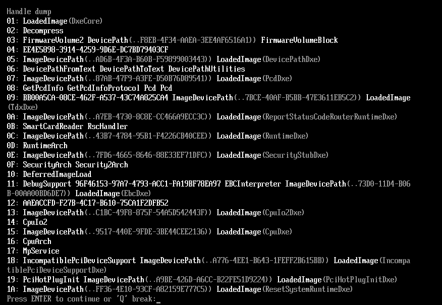


**¿Qué ves?** Una lista de todos los Handles del sistema:
```
Handle  Protocols
======  =========
1       LoadedImage
2       DevicePath, BlockIo
3       SimpleFileSystem, BlockIo
...
```

Cada número es un "Handle" (una cosa en el sistema).
Cada cosa bajo "Protocols" es una **interfaz** que esa cosa soporta.

- **BlockIo** = puedo leer/escribir bloques de datos (disco)
- **SimpleFileSystem** = puedo leer archivos
- **DevicePath** = puedo saber dónde está este dispositivo en el árbol de hardware


##  Pregunta de Razonamiento 1

- **Razonamiento 1**: en BIOS, las direcciones de E/S de hardware suelen estar predefinidas, por lo que un cambio puede causar fallos en el bootloader u otros componentes. En UEFI, se usan protocolos y handles asociados a cada componente. Por ejemplo, para acceder a un disco se busca el bloque de arranque dentro del dispositivo, sin importar si es SSD o HDD. Esto permite una abstracción más flexible y segura: solo los componentes con un protocolo válido y una firma verificable son cargados.
---


# Paso 2.3: Análisis de Variables Globales (NVRAM)

UEFI guarda configuración en **NVRAM** (memoria no volátil). Cuando apagas la PC, esos datos permanecen.

**Comando 1: Ver todas las variables**
```
Shell> dmpstore
```


Esto se ve como basura binaria porque las variables están **en formato binario**, no texto.


**Comando 2: Crear tu propia variable de prueba**
```
Shell> set TestSeguridad "GITarreros - Dario - Facundo - Joaquin"
```

**Comando 3: Listar solo variables de texto**
```
Shell> set -v
```


Vemos todas las variables que están en formato texto.

##  Pregunta de Razonamiento 2

- **Razonamiento 2**: el administrador de arranque UEFI identifica dispositivos booteables usando variables `Boot####`. Cada entrada contiene el nombre del dispositivo, la ruta de hardware y el archivo `.efi`. UEFI considera un dispositivo booteable cuando el medio está formateado en FAT32 y contiene la estructura estándar `EFI/BOOT`. Estas entradas se ordenan según la variable `BootOrder`; si el primer intento falla, se prueba el siguiente.


---

### Paso 2.4: Footprinting de Memoria y Hardware

Ahora vamos a inspeccionar **dónde está todo en memoria**.

**Comando 1: Ver mapa de memoria**
```
Shell> memmap -b
```
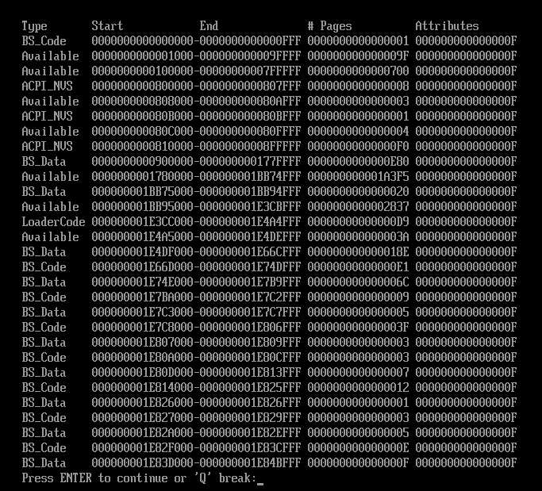
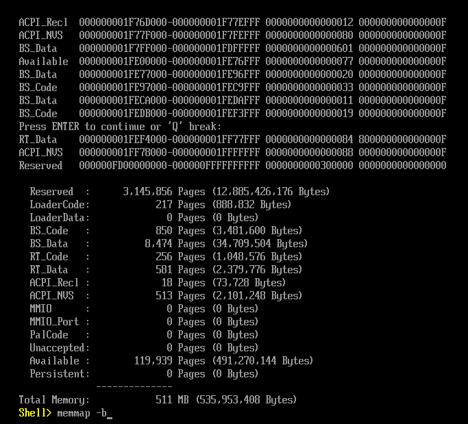


Las líneas importantes son:
- **LoaderCode**: Código que ya se ejecutó (bootloader, firmware early)
- **RuntimeServicesCode**: Código que **permanece en memoria después de que carga el SO**
- **Reserved**: Memoria reservada por el hardware


**Comando 2: Ver configuración PCI (buses, tarjetas)**
```
Shell> pci -b
```
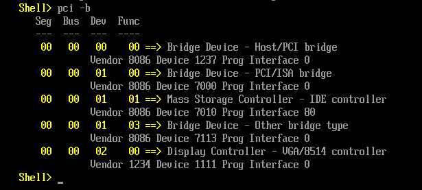


Cada línea es un dispositivo PCI (GPU, tarjeta de red, USB host, etc.).


**Comando 3: Ver drivers cargados**
```
Shell> drivers -b
```
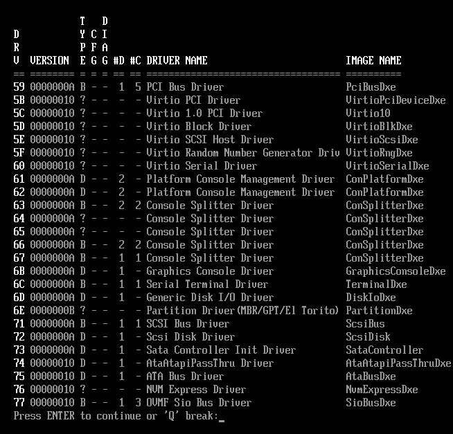


**¿Qué ves?** Los drivers UEFI activos en el sistema.


## Pregunta de Razonamiento 3

- **Razonamiento 3**: tras cargar el sistema operativo, los `BootServices` se liberan y se destruyen, mientras que los `RuntimeServices` permanecen accesibles. Por eso los bootkits pueden intentar inyectarse en las áreas de memoria de runtime para ejecutarse con alta prioridad.


#  TP2: Desarrollo, Compilación y Análisis de Aplicación UEFI

##  Objetivo

Crear una aplicación nativa UEFI en C, compilarla a formato PE/COFF, y analizarla con Ghidra.

---


# 2.1 Crear el archivo C

##  Desarrollo, compilación y análisis de seguridad

Se genera una aplicación EFI que se cargará desde la UEFI Shell. El código en C es el siguiente:

```c
#include <efi.h>

EFI_STATUS efi_main(EFI_HANDLE ImageHandle, EFI_SYSTEM_TABLE *SystemTable) {
    uefi_call_wrapper(SystemTable->ConOut->OutputString, 2,
                      SystemTable->ConOut,
                      L"Iniciando analisis de seguridad...\r\n");

    // Inyección de un software breakpoint (INT3)
    unsigned char code[] = { 0xCC };

    if (code[0] == 0xCC) {
        uefi_call_wrapper(SystemTable->ConOut->OutputString, 2,
                          SystemTable->ConOut,
                          L"Breakpoint estatico alcanzado.\r\n");
    }

    uefi_call_wrapper(SystemTable->BootServices->Stall, 1, 3000000);
    return EFI_SUCCESS;
}
```

### Notas sobre UEFI y E/S

En un entorno pre-OS no existe un kernel ni la biblioteca estándar de C. Por eso se utilizan los protocolos en `SystemTable` para salida de texto. El uso de `printf` no es posible porque no existe esa implementación en este entorno.

### Compilación

1. Generar el objeto:

```bash
gcc -I /usr/include/efi/ \
    -I /usr/include/efi/x86_64/ \
    -I /usr/include/efi/protocol/ \
    -fpic -ffreestanding -fno-stack-protector -fno-strict-aliasing \
    -fshort-wchar -mno-red-zone -maccumulate-outgoing-args -Wall \
    -c -o aplicacion.o aplicacion.c
```

2. Enlazar el ejecutable EFI:

```bash
ld -shared -Bsymbolic \
   -L /usr/lib/ -L /usr/lib/efi \
   -T /usr/lib/elf_x86_64_efi.lds \
   /usr/lib/crt0-efi-x86_64.o aplicacion.o \
   -o aplicacion.so -lefi -lgnuefi
```

3. Generar el binario `.efi`:

```bash
objcopy -j .text -j .sdata -j .data -j .dynamic -j .dynsym \
        -j .rel -j .rela -j .rel.* -j .rela.* -j .reloc \
        --target=efi-app-x86_64 aplicacion.so aplicacion.efi
```
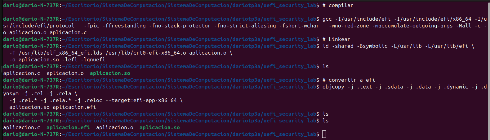

---
# 2.3: Análisis de Metadatos y Decompilación

```bash
dario@dario-N-737R:~/Escritorio/SistemaDeComputacion/SistemaDeComputacion/dariotp3a/uefi_security_lab$ file aplicacion.efi
```
Resultado:
```
aplicacion.efi: PE32+ executable (EFI application) x86-64 (stripped to external PDB), for MS Windows, 5 sections
```


**Tenemos el ejecutable UEFI real.**

---

## Analizar con Ghidra

```bash
ghidra &
```


En Ghidra:
1. **File** → **New Project**
2. Elige carpeta: `uefi_security_lab`
3. Nombre: `uefi_analysis`
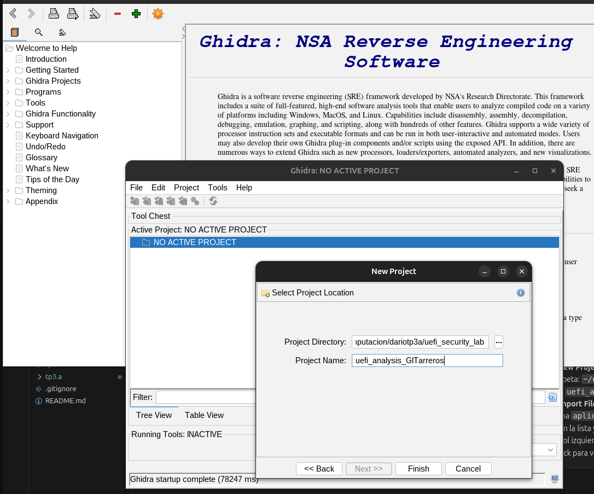


4. **File** → **Import File**
5. Selecciona `aplicacion.efi`

luego doble click en aplicacion.efi
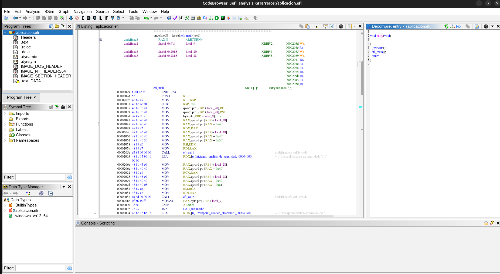


6. Clickea en la lista y presiona **Analyze**
7. En el árbol izquierdo, busca: **efi_main**
8. Doble-click para ver el código descompilado


---

# 2.4:  Ejecutar aplicacion.efi en QEMU


```bash
qemu-system-x86_64 -m 512 \
  -bios /usr/share/ovmf/OVMF.fd \
  -net none \
  -drive file=fat:rw:$HOME/uefi_security_lab,format=raw
```

Cuando QEMU arranque, presiona **Esc** para entrar a Shell.

```
Shell> map
```
Finalmente, ejecuta tu app:
```
FS0:\> aplicacion.efi
```


---


Al analizar el binario con GHIDRA, el valor `0xCC` puede aparecer como `-52` porque GHIDRA no conoce el contexto de compilación y puede interpretar un `char` como valor con signo.


# TP3


## 5. Preparación del medio de arranque USB

Para usar un pendrive identificado como `/dev/sda`, el dispositivo debe estar formateado en FAT32 y tener la estructura UEFI correcta.

1. Desmontar el pendrive:

```bash
sudo umount /dev/sda
```

2. Formatear en FAT32:

```bash
sudo mkfs.vfat -F 32 /dev/sda
```

3. Montar el pendrive:

```bash
sudo mount /dev/sda /mnt
```

4. Crear la carpeta UEFI estándar:

```bash
sudo mkdir -p /mnt/EFI/BOOT
```

5. Copiar la shell oficial de UEFI:

```bash
sudo cp ~/../../edk2/Build/OvmfX64/RELEASE_GCC/X64/Shell.efi /mnt/EFI/BOOT/BOOTX64.EFI
```

> Nota: en este caso se usó un repositorio local de EDK2 ya disponible en el sistema.

6. Copiar el programa EFI al pendrive:

```bash
sudo cp ~/../aplicacion.efi /mnt/
```

## 6. Arranque en QEMU con el USB virtual

Para simular el arranque en una máquina virtual:

```bash
sudo qemu-system-x86_64 \
  -drive if=pflash,format=raw,readonly=on,file=/../edk2/Build/OvmfX64/RELEASE_GCC/FV/OVMF_CODE.fd \
  -drive if=pflash,format=raw,file=/../edk2/Build/OvmfX64/RELEASE_GCC/FV/OVMF_VARS.fd \
  -drive file=/dev/sda,format=raw \
  -net none
```

Desde la UEFI Shell de la máquina virtual se puede navegar al dispositivo y ejecutar `aplicacion.efi`.

## 7. Resultados

Al iniciar la UEFI Shell se puede acceder al dispositivo de arranque y ejecutar el binario. El comportamiento esperado es imprimir mensajes en pantalla y pausar unos segundos con `BootServices->Stall`.


