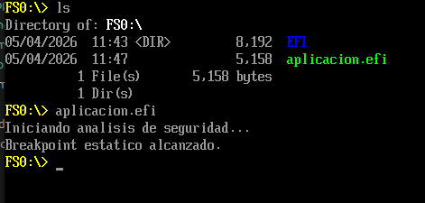

# TP3 - Ejercicio 3.a

## 3.1 Objetivo general

Comprender la arquitectura de la Interfaz de Firmware Extensible Unificada (UEFI) como un entorno pre-sistema operativo, desarrollar binarios nativos, entender su formato y ejecutar rutinas tanto en entornos emulados como en hardware físico (bare metal).

## Requisitos

Para realizar este trabajo es necesario contar con las siguientes herramientas instaladas:

- `QEMU`: emulador de arquitecturas de hardware y virtualización.
- `OVMF`: firmware UEFI para QEMU que reemplaza el BIOS legacy.
- `GNU-EFI`: entorno de desarrollo cruzado para compilar binarios EFI con `gcc`.
- `GHIDRA`: herramienta de ingeniería inversa para analizar y decompilar binarios UEFI.

## 1. Preparación del entorno

1. Crear el directorio de trabajo:

```bash
mkdir -p ~/uefi_security_lab && cd ~/uefi_security_lab
```

2. Instalar las dependencias base:

```bash
sudo apt install -y qemu-system-x86 ovmf gnu-efi build-essential binutils-mingw-w64
```

3. Instalar GHIDRA (por APT o Snap):

```bash
sudo apt install -y ghidra || sudo snap install ghidra --classic
```

## 2. Arranque en QEMU

Para iniciar un entorno UEFI con QEMU:

```bash
qemu-system-x86_64 -m 512 -bios /usr/share/ovmf/OVMF.fd -net none
```

Este arranque lanza un firmware UEFI completo con su propio gestor de memoria, consola y soporte de dispositivo.

## 3. Exploración de dispositivos en UEFI

UEFI no utiliza letras de unidad fijas como `C:`. En su lugar, mantiene una base de datos de "handles" que agrupan protocolos de software como `SIMPLE_FILE_SYSTEM`.

Comandos útiles en la UEFI Shell:

```text
Shell> map
Shell> FS0:
FS0:\> ls
Shell> dh -b
```

### Razonamientos clave

- **Razonamiento 1**: en BIOS, las direcciones de E/S de hardware suelen estar predefinidas, por lo que un cambio puede causar fallos en el bootloader u otros componentes. En UEFI, se usan protocolos y handles asociados a cada componente. Por ejemplo, para acceder a un disco se busca el bloque de arranque dentro del dispositivo, sin importar si es SSD o HDD. Esto permite una abstracción más flexible y segura: solo los componentes con un protocolo válido y una firma verificable son cargados.

- **Razonamiento 2**: el administrador de arranque UEFI identifica dispositivos booteables usando variables `Boot####`. Cada entrada contiene el nombre del dispositivo, la ruta de hardware y el archivo `.efi`. UEFI considera un dispositivo booteable cuando el medio está formateado en FAT32 y contiene la estructura estándar `EFI/BOOT`. Estas entradas se ordenan según la variable `BootOrder`; si el primer intento falla, se prueba el siguiente.

- **Razonamiento 3**: tras cargar el sistema operativo, los `BootServices` se liberan y se destruyen, mientras que los `RuntimeServices` permanecen accesibles. Por eso los bootkits pueden intentar inyectarse en las áreas de memoria de runtime para ejecutarse con alta prioridad.

## 4. Desarrollo, compilación y análisis de seguridad

Se genera una aplicación EFI que se cargará desde la UEFI Shell. El código en C es el siguiente:

```c
#include <efi.h>

EFI_STATUS efi_main(EFI_HANDLE ImageHandle, EFI_SYSTEM_TABLE *SystemTable) {
    uefi_call_wrapper(SystemTable->ConOut->OutputString, 2,
                      SystemTable->ConOut,
                      L"Iniciando analisis de seguridad...\r\n");

    // Inyección de un software breakpoint (INT3)
    unsigned char code[] = { 0xCC };

    if (code[0] == 0xCC) {
        uefi_call_wrapper(SystemTable->ConOut->OutputString, 2,
                          SystemTable->ConOut,
                          L"Breakpoint estatico alcanzado.\r\n");
    }

    uefi_call_wrapper(SystemTable->BootServices->Stall, 1, 3000000);
    return EFI_SUCCESS;
}
```

### Notas sobre UEFI y E/S

En un entorno pre-OS no existe un kernel ni la biblioteca estándar de C. Por eso se utilizan los protocolos en `SystemTable` para salida de texto. El uso de `printf` no es posible porque no existe esa implementación en este entorno.

### Compilación

1. Generar el objeto:

```bash
gcc -I /usr/include/efi/ \
    -I /usr/include/efi/x86_64/ \
    -I /usr/include/efi/protocol/ \
    -fpic -ffreestanding -fno-stack-protector -fno-strict-aliasing \
    -fshort-wchar -mno-red-zone -maccumulate-outgoing-args -Wall \
    -c -o aplicacion.o aplicacion.c
```

2. Enlazar el ejecutable EFI:

```bash
ld -shared -Bsymbolic \
   -L /usr/lib/ -L /usr/lib/efi \
   -T /usr/lib/elf_x86_64_efi.lds \
   /usr/lib/crt0-efi-x86_64.o aplicacion.o \
   -o aplicacion.so -lefi -lgnuefi
```

3. Generar el binario `.efi`:

```bash
objcopy -j .text -j .sdata -j .data -j .dynamic -j .dynsym \
        -j .rel -j .rela -j .rel.* -j .rela.* -j .reloc \
        --target=efi-app-x86_64 aplicacion.so aplicacion.efi
```

### Observación con GHIDRA

Al analizar el binario con GHIDRA, el valor `0xCC` puede aparecer como `-52` porque GHIDRA no conoce el contexto de compilación y puede interpretar un `char` como valor con signo.

## 5. Preparación del medio de arranque USB

Para usar un pendrive identificado como `/dev/sda`, el dispositivo debe estar formateado en FAT32 y tener la estructura UEFI correcta.

1. Desmontar el pendrive:

```bash
sudo umount /dev/sda
```

2. Formatear en FAT32:

```bash
sudo mkfs.vfat -F 32 /dev/sda
```

3. Montar el pendrive:

```bash
sudo mount /dev/sda /mnt
```

4. Crear la carpeta UEFI estándar:

```bash
sudo mkdir -p /mnt/EFI/BOOT
```

5. Copiar la shell oficial de UEFI:

```bash
sudo cp ~/../../edk2/Build/OvmfX64/RELEASE_GCC/X64/Shell.efi /mnt/EFI/BOOT/BOOTX64.EFI
```

> Nota: en este caso se usó un repositorio local de EDK2 ya disponible en el sistema.

6. Copiar el programa EFI al pendrive:

```bash
sudo cp ~/../aplicacion.efi /mnt/
```

## 6. Arranque en QEMU con el USB virtual

Para simular el arranque en una máquina virtual:

```bash
sudo qemu-system-x86_64 \
  -drive if=pflash,format=raw,readonly=on,file=/../edk2/Build/OvmfX64/RELEASE_GCC/FV/OVMF_CODE.fd \
  -drive if=pflash,format=raw,file=/../edk2/Build/OvmfX64/RELEASE_GCC/FV/OVMF_VARS.fd \
  -drive file=/dev/sda,format=raw \
  -net none
```

Desde la UEFI Shell de la máquina virtual se puede navegar al dispositivo y ejecutar `aplicacion.efi`.

## 7. Resultados

Al iniciar la UEFI Shell se puede acceder al dispositivo de arranque y ejecutar el binario. El comportamiento esperado es imprimir mensajes en pantalla y pausar unos segundos con `BootServices->Stall`.


