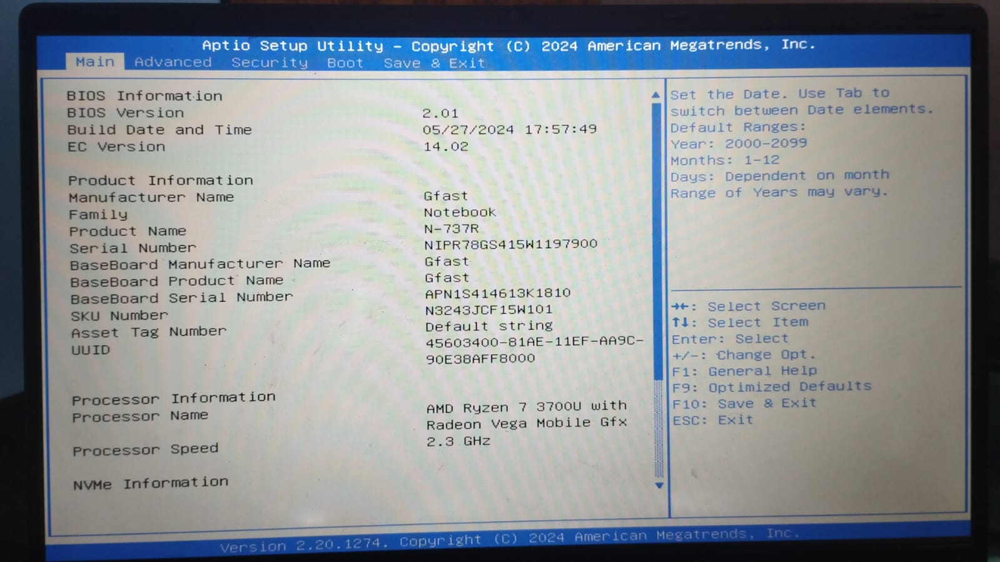
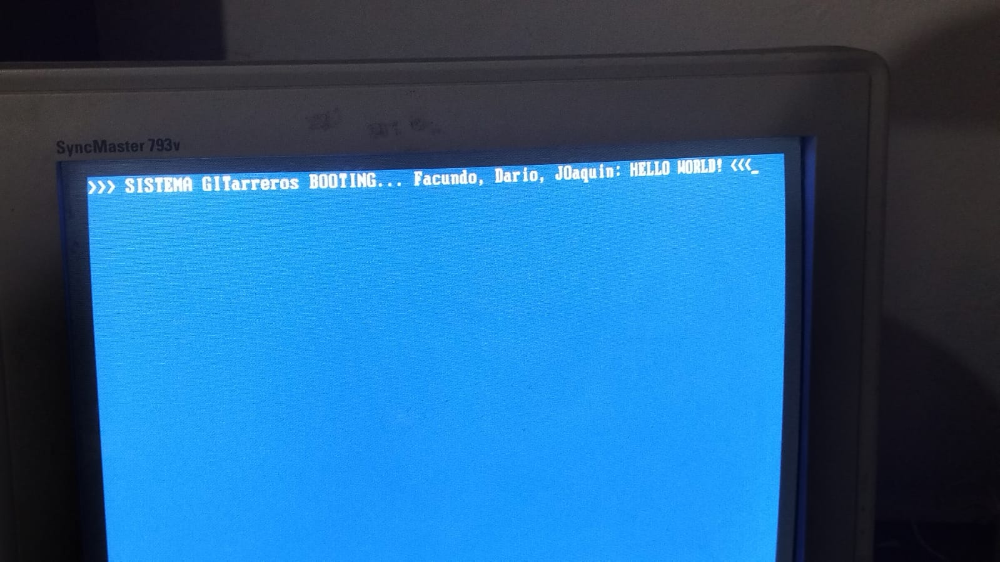
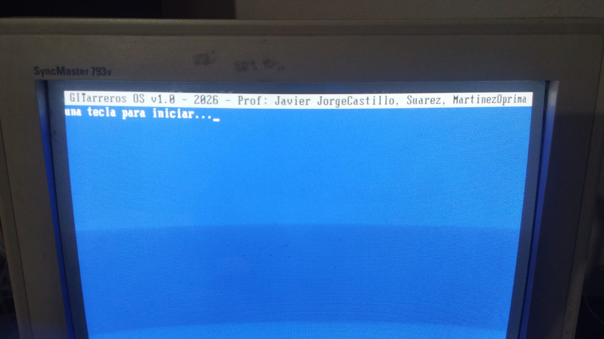
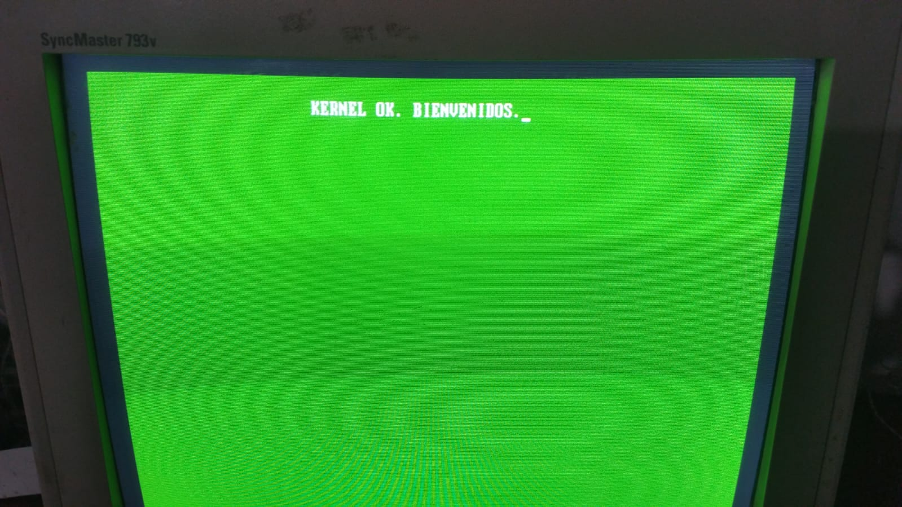
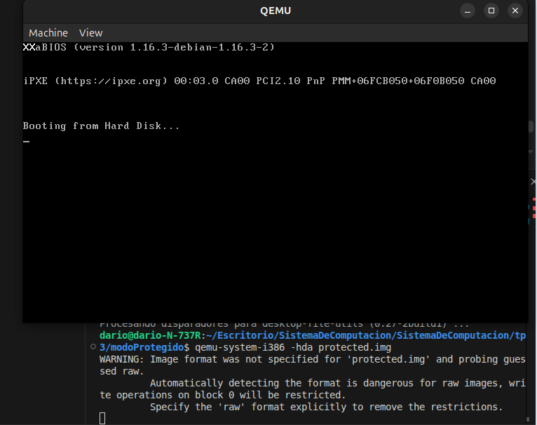
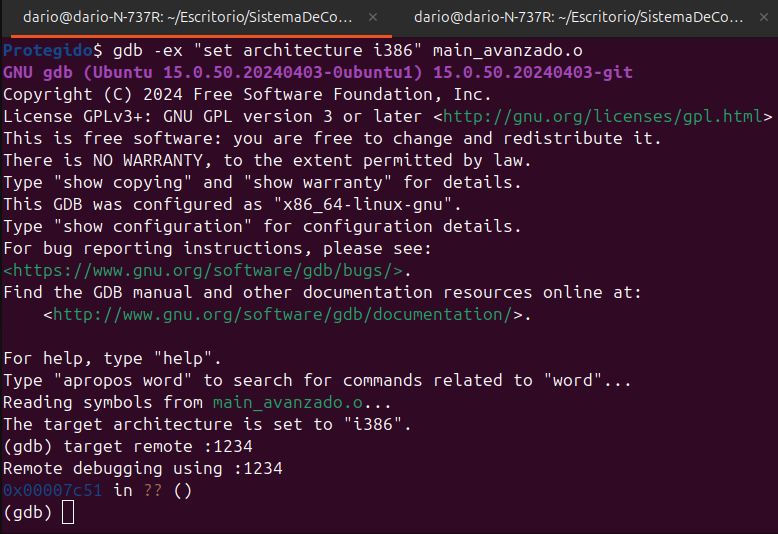
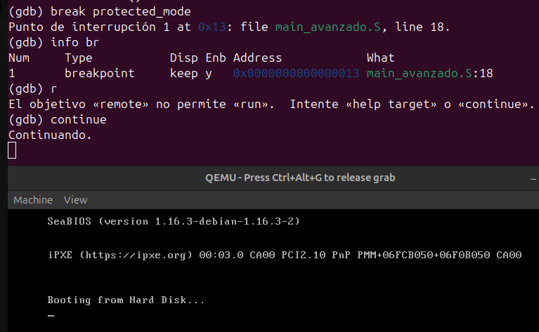
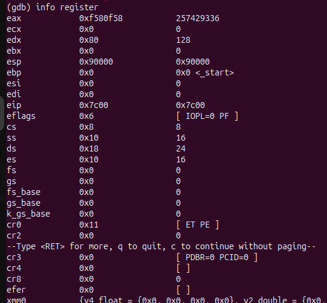
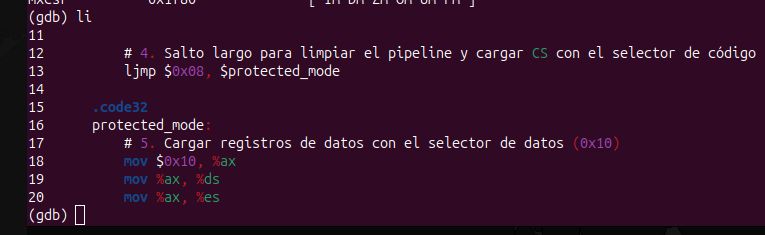

# QUEMU


Es una herramienta de código abierto extremadamente potente que sirve para dos cosas principales: **emulación** (simular hardware diferente) y **virtualización** (correr sistemas con alto rendimiento).

---

## 1. Conceptos Básicos
* **Emulación:** Puede imitar arquitecturas de CPU. Por ejemplo, puedes correr software de ARM (como el de una Raspberry Pi) en una PC normal (x86_64). Es lento pero muy flexible.
* **Virtualización:** Cuando se usa junto con **KVM** (Kernel-based Virtual Machine) en Linux, funciona casi a la velocidad nativa del equipo.

---

## 2. Cómo Instalarlo
Dependiendo de tu sistema operativo, el comando cambia:

* **Ubuntu/Debian:**
    `sudo apt update && sudo apt install qemu-system qemu-utils`
* **Arch Linux:**
    `sudo pacman -S qemu-full`
* **Fedora:**
    `sudo dnf install qemu-kvm`
* **macOS:**
    `brew install qemu`

---

## 3. Guía Rápida: Crear y Correr una Imagen

Para poner en marcha una máquina virtual desde la terminal, sigue estos pasos:

### Paso A: Crear el "Disco Duro" Virtual
Primero necesitas un espacio donde instalar el sistema. Vamos a crear un archivo de 20GB en formato `qcow2` (que solo ocupa espacio a medida que lo llenas).

```bash
qemu-img create -f qcow2 mi_disco.qcow2 20G
```

### Paso B: Iniciar la Instalación
Supongamos que tienes una ISO de Ubuntu. El siguiente comando arranca la máquina virtual con 4GB de RAM y conecta la ISO:

```bash
qemu-system-x86_64 \
  -m 4G \
  -enable-kvm \
  -drive file=mi_disco.qcow2,format=qcow2 \
  -cdrom ubuntu-desktop.iso \
  -boot d
```
> **Nota:** `-enable-kvm` es vital en Linux para que no vaya lento como una tortuga.

### Paso C: Correr la imagen ya instalada
Una vez instalado, ya no necesitas el `-cdrom`. Simplemente arrancas desde el disco:

```bash
qemu-system-x86_64 -m 4G -enable-kvm -hda mi_disco.qcow2
```

---

## 4. Diferencias Clave con VirtualBox
| Característica | QEMU | VirtualBox / VMware |
| :--- | :--- | :--- |
| **Interfaz** | Principalmente terminal (CLI) | Gráfica (GUI) |
| **Rendimiento** | Superior (con KVM) | Muy bueno |
| **Flexibilidad** | Puede emular casi cualquier CPU | Solo x86/ARM nativo |
| **Dificultad** | Curva de aprendizaje alta | Fácil de usar |

---


---
---
---

---

# 1. Desafío: UEFI y coreboot
---
## **¿Qué es UEFI? ¿Cómo puedo usarlo?**
UEFI (*Unified Extensible Firmware Interface*) es el sucesor de la BIOS. A diferencia de la BIOS, que es código de 16 bits muy limitado, UEFI es un pequeño "sistema operativo" en sí mismo, escrito en C, que corre en 32 o 64 bits.
* **Cómo usarlo:** Para programar para UEFI, no usas interrupciones de BIOS (`int 0x10`). Debemos crear un archivo `.efi` (formato PE, como los .exe de Windows) y usar las "Boot Services" que proporciona el firmware.
* **Función de ejemplo:** `Print()` o `OutputString()`. En UEFI se accede a través de una tabla de punteros llamada `SystemTable->ConOut->OutputString`.
---

## **Bugs de UEFI explotados:**
Al ser un software complejo, tiene vulnerabilidades.
* **LogoFAIL:** Reciente bug donde atacantes usan imágenes de logo de arranque (JPG/BMP) maliciosas para ejecutar código antes que el SO.
* **BlackLotus:** Un bootkit que logra saltarse el *Secure Boot* (Arranque Seguro) para persistir en el sistema incluso si reinstalas Windows.
---
## **¿Qué es CSME y Intel MEBx?**
* **CSME:** Converged Security and Management Engine Es un subsistema dentro de los procesadores Intel que corre un kernel (generalmente Minix) totalmente independiente del procesador principal. Controla el encendido, la criptografía y la gestión remota. Es "el anillo -3" de seguridad.
* **Intel MEBx:** the Intel Management Engine BIOS Extension Es la interfaz de configuración de este motor. Se suele acceder con `Ctrl+P` durante el booteo para configurar la administración remota (AMT).
---
## **¿Qué es Coreboot?**
Es un proyecto de software libre que busca reemplazar la BIOS/UEFI privativa de las placas base por un firmware mínimo y rápido.
* **Productos:** Computadoras de System76, Purism, o las famosas Chromebooks de Google.
* **Ventajas:** Mucho más rápido (bootea en segundos), mayor seguridad  y elimina "blobs" binarios innecesarios.

---


# 2. Análisis del "Hello World" (Linker y Código)

**link.d:**
```ld
SECTIONS
{
    /* The BIOS loads the code from the disk to this location.
     * We must tell that to the linker so that it can properly
     * calculate the addresses of symbols we might jump to.
     */
    . = 0x7c00;
    .text :
    {
        __start = .;
        *(.text)
        /* Place the magic boot bytes at the end of the first 512 sector. */
        . = 0x1FE;
        SHORT(0xAA55)
    }
}
```
**Main.S:**
```asm
.code16
    mov $msg, %si
    mov $0x0e, %ah
loop:
    lodsb
    or %al, %al
    jz halt
    int $0x10
    jmp loop
halt:
    hlt
msg:
    .asciz "hello world"
```
El código es un sector de arranque

```bash!
# 1. Ensamblar (pasar el texto .S a código máquina .o)
as -g -o main.o main.S
```

```bash!
# 2. Enlazar (usar el script .ld para poner todo en su lugar y crear el binario final)
ld --oformat binary -o main.img -T link.ld main.o

```


---

## **¿Qué es un Linker y qué hace?**
El linker (enlazador) toma los archivos objeto (`main.o`) y decide dónde colocar cada sección de código y datos en el archivo final (`main.img`). Resuelve las direcciones de memoria para que cuando el código diga `jmp loop`, el salto vaya a la dirección correcta.

---

## **¿Qué es la dirección `0x7c00`? ¿Por qué es necesaria?**
Es una dirección **mágica**. Por estándar histórico, la BIOS busca el primer sector del disco (512 bytes), lo copia exactamente en la dirección de memoria RAM `0x0000:0x7C00` y luego le dice a la CPU: "empieza a ejecutar desde aquí".
* **Necesidad:** El linker necesita saber esto para que las etiquetas (como `msg`) tengan la dirección de memoria real correcta. Si el linker cree que el código empieza en `0x0000` pero la BIOS lo pone en `0x7C00`, el programa buscará el texto en el lugar equivocado y fallará.

**Opción `--oformat binary`:**
Normalmente, el linker crea archivos tipo ELF (que tienen cabeceras para Linux). La opción `binary` le dice: "No pongas metadatos, solo tira los bytes puros de mi código uno tras otro". Esto es vital porque el hardware real no entiende formatos de archivos, solo ejecuta bytes.

---

## 3. Comparativa: `objdump` vs `hd` (Heardump)

1.  `objdump -D main.o`: Veremos el código ensamblador y cómo el linker aún no sabe las direcciones finales:
```bash
dario@dario-N-737R:~/Escritorio/SistemaDeComputacion/SistemaDeComputacion/tp3$ objdump -D main.o

main.o:     formato del fichero elf64-x86-64


Desensamblado de la sección .text:

0000000000000000 <loop-0x5>:
   0:   be 00 00 b4 0e          mov    $0xeb40000,%esi

0000000000000005 <loop>:
   5:   ac                      lods   %ds:(%rsi),%al
   6:   08 c0                   or     %al,%al
   8:   74 04                   je     e <halt>
   a:   cd 10                   int    $0x10
   c:   eb f7                   jmp    5 <loop>

000000000000000e <halt>:
   e:   f4                      hlt

000000000000000f <msg>:
   f:   68 65 6c 6c 6f          push   $0x6f6c6c65
  14:   20 77 6f                and    %dh,0x6f(%rdi)
  17:   72 6c                   jb     85 <msg+0x76>
  19:   64                      fs
        ...

Desensamblado de la sección .debug_line:

0000000000000000 <.debug_line>:
   0:   38 00                   cmp    %al,(%rax)
   2:   00 00                   add    %al,(%rax)
   4:   02 00                   add    (%rax),%al
   6:   1a 00                   sbb    (%rax),%al
   8:   00 00                   add    %al,(%rax)
   a:   01 01                   add    %eax,(%rcx)
   c:   fb                      sti
   d:   0e                      (bad)
   e:   0a 00                   or     (%rax),%al
  10:   01 01                   add    %eax,(%rcx)
  12:   01 01                   add    %eax,(%rcx)
  14:   00 00                   add    %al,(%rax)
  16:   00 01                   add    %al,(%rcx)
  18:   00 6d 61                add    %ch,0x61(%rbp)
  1b:   69 6e 2e 53 00 00 00    imul   $0x53,0x2e(%rsi),%ebp
  22:   00 00                   add    %al,(%rax)
  24:   00 09                   add    %cl,(%rcx)
  26:   02 00                   add    (%rax),%al
  28:   00 00                   add    %al,(%rax)
  2a:   00 00                   add    %al,(%rax)
  2c:   00 00                   add    %al,(%rax)
  2e:   00 10                   add    %dl,(%rax)
  30:   3a 2d 1e 2c 2c 2c       cmp    0x2c2c2c1e(%rip),%ch        # 2c2c2c54 <msg+0x2c2c2c45>
  36:   2d 02 0d 00 01          sub    $0x1000d02,%eax
  3b:   01                      .byte 0x1

Desensamblado de la sección .debug_info:

0000000000000000 <.debug_info>:
   0:   2a 00                   sub    (%rax),%al
   2:   00 00                   add    %al,(%rax)
   4:   02 00                   add    (%rax),%al
   6:   00 00                   add    %al,(%rax)
   8:   00 00                   add    %al,(%rax)
   a:   08 01                   or     %al,(%rcx)
        ...
  2c:   01                      .byte 0x1
  2d:   80                      .byte 0x80

Desensamblado de la sección .debug_abbrev:

0000000000000000 <.debug_abbrev>:
   0:   01 11                   add    %edx,(%rcx)
   2:   00 10                   add    %dl,(%rax)
   4:   06                      (bad)
   5:   11 01                   adc    %eax,(%rcx)
   7:   12 01                   adc    (%rcx),%al
   9:   03 0e                   add    (%rsi),%ecx
   b:   1b 0e                   sbb    (%rsi),%ecx
   d:   25 0e 13 05 00          and    $0x5130e,%eax
        ...

Desensamblado de la sección .debug_aranges:

0000000000000000 <.debug_aranges>:
   0:   2c 00                   sub    $0x0,%al
   2:   00 00                   add    %al,(%rax)
   4:   02 00                   add    (%rax),%al
   6:   00 00                   add    %al,(%rax)
   8:   00 00                   add    %al,(%rax)
   a:   08 00                   or     %al,(%rax)
        ...
  18:   1b 00                   sbb    (%rax),%eax
        ...

Desensamblado de la sección .debug_str:

0000000000000000 <.debug_str>:
   0:   6d                      insl   (%dx),%es:(%rdi)
   1:   61                      (bad)
   2:   69 6e 2e 53 00 2f 68    imul   $0x682f0053,0x2e(%rsi),%ebp
   9:   6f                      outsl  %ds:(%rsi),(%dx)
   a:   6d                      insl   (%dx),%es:(%rdi)
   b:   65 2f                   gs (bad)
   d:   64 61                   fs (bad)
   f:   72 69                   jb     7a <msg+0x6b>
  11:   6f                      outsl  %ds:(%rsi),(%dx)
  12:   2f                      (bad)
  13:   45 73 63                rex.RB jae 79 <msg+0x6a>
  16:   72 69                   jb     81 <msg+0x72>
  18:   74 6f                   je     89 <msg+0x7a>
  1a:   72 69                   jb     85 <msg+0x76>
  1c:   6f                      outsl  %ds:(%rsi),(%dx)
  1d:   2f                      (bad)
  1e:   53                      push   %rbx
  1f:   69 73 74 65 6d 61 44    imul   $0x44616d65,0x74(%rbx),%esi
  26:   65 43 6f                rex.XB outsl %gs:(%rsi),(%dx)
  29:   6d                      insl   (%dx),%es:(%rdi)
  2a:   70 75                   jo     a1 <msg+0x92>
  2c:   74 61                   je     8f <msg+0x80>
  2e:   63 69 6f                movsxd 0x6f(%rcx),%ebp
  31:   6e                      outsb  %ds:(%rsi),(%dx)
  32:   2f                      (bad)
  33:   53                      push   %rbx
  34:   69 73 74 65 6d 61 44    imul   $0x44616d65,0x74(%rbx),%esi
  3b:   65 43 6f                rex.XB outsl %gs:(%rsi),(%dx)
  3e:   6d                      insl   (%dx),%es:(%rdi)
  3f:   70 75                   jo     b6 <msg+0xa7>
  41:   74 61                   je     a4 <msg+0x95>
  43:   63 69 6f                movsxd 0x6f(%rcx),%ebp
  46:   6e                      outsb  %ds:(%rsi),(%dx)
  47:   2f                      (bad)
  48:   74 70                   je     ba <msg+0xab>
  4a:   33 00                   xor    (%rax),%eax
  4c:   47                      rex.RXB
  4d:   4e 55                   rex.WRX push %rbp
  4f:   20 41 53                and    %al,0x53(%rcx)
  52:   20 32                   and    %dh,(%rdx)
  54:   2e 34 32                cs xor $0x32,%al
        ...
```


2.  `hexdump -C main.img`: Veremos los bytes puros:

```bash!
dario@dario-N-737R:~/Escritorio/SistemaDeComputacion/SistemaDeComputacion/tp3$ hexdump -C main.img
00000000  be 0f 7c b4 0e ac 08 c0  74 04 cd 10 eb f7 f4 68  |..|.....t......h|
00000010  65 6c 6c 6f 20 77 6f 72  6c 64 00 66 2e 0f 1f 84  |ello world.f....|
00000020  00 00 00 00 00 66 2e 0f  1f 84 00 00 00 00 00 66  |.....f.........f|
00000030  2e 0f 1f 84 00 00 00 00  00 66 2e 0f 1f 84 00 00  |.........f......|
00000040  00 00 00 66 2e 0f 1f 84  00 00 00 00 00 66 2e 0f  |...f.........f..|
00000050  1f 84 00 00 00 00 00 66  2e 0f 1f 84 00 00 00 00  |.......f........|
00000060  00 66 2e 0f 1f 84 00 00  00 00 00 66 2e 0f 1f 84  |.f.........f....|
00000070  00 00 00 00 00 66 2e 0f  1f 84 00 00 00 00 00 66  |.....f.........f|
00000080  2e 0f 1f 84 00 00 00 00  00 66 2e 0f 1f 84 00 00  |.........f......|
00000090  00 00 00 66 2e 0f 1f 84  00 00 00 00 00 66 2e 0f  |...f.........f..|
000000a0  1f 84 00 00 00 00 00 66  2e 0f 1f 84 00 00 00 00  |.......f........|
000000b0  00 66 2e 0f 1f 84 00 00  00 00 00 66 2e 0f 1f 84  |.f.........f....|
000000c0  00 00 00 00 00 66 2e 0f  1f 84 00 00 00 00 00 66  |.....f.........f|
000000d0  2e 0f 1f 84 00 00 00 00  00 66 2e 0f 1f 84 00 00  |.........f......|
000000e0  00 00 00 66 2e 0f 1f 84  00 00 00 00 00 66 2e 0f  |...f.........f..|
000000f0  1f 84 00 00 00 00 00 66  2e 0f 1f 84 00 00 00 00  |.......f........|
00000100  00 66 2e 0f 1f 84 00 00  00 00 00 66 2e 0f 1f 84  |.f.........f....|
00000110  00 00 00 00 00 66 2e 0f  1f 84 00 00 00 00 00 66  |.....f.........f|
00000120  2e 0f 1f 84 00 00 00 00  00 66 2e 0f 1f 84 00 00  |.........f......|
00000130  00 00 00 66 2e 0f 1f 84  00 00 00 00 00 66 2e 0f  |...f.........f..|
00000140  1f 84 00 00 00 00 00 66  2e 0f 1f 84 00 00 00 00  |.......f........|
00000150  00 66 2e 0f 1f 84 00 00  00 00 00 66 2e 0f 1f 84  |.f.........f....|
00000160  00 00 00 00 00 66 2e 0f  1f 84 00 00 00 00 00 66  |.....f.........f|
00000170  2e 0f 1f 84 00 00 00 00  00 66 2e 0f 1f 84 00 00  |.........f......|
00000180  00 00 00 66 2e 0f 1f 84  00 00 00 00 00 66 2e 0f  |...f.........f..|
00000190  1f 84 00 00 00 00 00 66  2e 0f 1f 84 00 00 00 00  |.......f........|
000001a0  00 66 2e 0f 1f 84 00 00  00 00 00 66 2e 0f 1f 84  |.f.........f....|
000001b0  00 00 00 00 00 66 2e 0f  1f 84 00 00 00 00 00 66  |.....f.........f|
000001c0  2e 0f 1f 84 00 00 00 00  00 66 2e 0f 1f 84 00 00  |.........f......|
000001d0  00 00 00 66 2e 0f 1f 84  00 00 00 00 00 66 2e 0f  |...f.........f..|
000001e0  1f 84 00 00 00 00 00 66  2e 0f 1f 84 00 00 00 00  |.......f........|
000001f0  00 66 2e 0f 1f 84 00 00  00 00 00 0f 1f 00 55 aa  |.f............U.|
00000200
dario@dario-N-737R:~/Escritorio/SistemaDeComputacion/SistemaDeComputacion/tp3$ 
```


    * **Verificación:** Notamos que al final del archivo (en el byte 510 y 511) aparecen los bytes `55 AA`. Esa es la **firma de arranque**. Sin esos dos bytes, la BIOS dirá "No bootable device found".

---

## 4. Prueba en Hardware Real (El USB)

Cuando haces:
`sudo dd if=main.img of=/dev/sdX`
Estás borrando la tabla de particiones del USB y escribiendo tu "Hello World" directamente en el primer sector. 
* **Advertencia:** Ten mucho cuidado de que `/dev/sdX` sea realmente tu USB (puedes usar `lsblk` para verificar) o podrías borrar tu propio disco duro.

Una vez grabado, al apagar tu PC y elegir el USB como arranque, deberías ver las letras blancas sobre fondo negro: `hello world`. ¡Habrás corrido tu propio software sin necesidad de Windows ni Linux!


# Grabado de pendrive:

### Paso 1: Compilación y Enlazado (Generar la imagen)
```bash
# 1. Ensamblar (pasa el texto .S a código máquina .o)
as -g -o main.o main.S

# 2. Enlazar (usa el script .ld para poner todo en su lugar y crear el binario final)
ld --oformat binary -o main.img -T link.ld main.o
```

### Paso 2: Identificar tu Pendrive:


- 1  conectar pendrive
- 2  Abrir terminal escribit:

```bash
lsblk
```
resultado:
```bash
dario@dario-N-737R:~$ lsblk
NAME        MAJ:MIN RM   SIZE RO TYPE MOUNTPOINTS
loop0         7:0    0  55,5M  1 loop /snap/core18/2979
loop1         7:1    0     4K  1 loop /snap/bare/5
loop2         7:2    0  55,5M  1 loop /snap/core18/2999
loop3         7:3    0  63,8M  1 loop /snap/core20/2717
loop4         7:4    0    74M  1 loop /snap/core22/2292
loop5         7:5    0  63,8M  1 loop /snap/core20/2769
loop6         7:6    0    74M  1 loop /snap/core22/2411
loop7         7:7    0  66,8M  1 loop /snap/core24/1499
loop8         7:8    0  66,8M  1 loop /snap/core24/1587
loop9         7:9    0 273,7M  1 loop /snap/firefox/8107
loop10        7:10   0  16,4M  1 loop /snap/firmware-updater/223
loop11        7:11   0 274,8M  1 loop /snap/firefox/8191
loop12        7:12   0 531,4M  1 loop /snap/gnome-42-2204/247
loop13        7:13   0  16,4M  1 loop /snap/firmware-updater/224
loop14        7:14   0 516,2M  1 loop /snap/gnome-42-2204/226
loop15        7:15   0 606,1M  1 loop /snap/gnome-46-2404/153
loop16        7:16   0  91,7M  1 loop /snap/gtk-common-themes/1535
loop17        7:17   0  27,6M  1 loop /snap/k6/52
loop18        7:18   0  32,5M  1 loop /snap/k6/55
loop19        7:19   0   395M  1 loop /snap/mesa-2404/1165
loop20        7:20   0  15,6M  1 loop /snap/snap-store/1338
loop21        7:21   0  15,7M  1 loop /snap/snap-store/1367
loop22        7:22   0  48,4M  1 loop /snap/snapd/26382
loop23        7:23   0  49,3M  1 loop /snap/snapd/26865
loop24        7:24   0   580K  1 loop /snap/snapd-desktop-integration/357
loop25        7:25   0   580K  1 loop /snap/snapd-desktop-integration/361
loop26        7:26   0   4,4M  1 loop /snap/tree/54
loop27        7:27   0 321,1M  1 loop /snap/vlc/3777
sda           8:0    1  28,8G  0 disk 
└─sda1        8:1    1  28,8G  0 part /media/dario/DARIO
mmcblk0     179:0    0  29,1G  0 disk 
├─mmcblk0p1 179:1    0   512M  0 part 
└─mmcblk0p2 179:2    0  28,6G  0 part /media/dario/8a23abe5-c1e1-4b3e-9757-e41b4485c9232
nvme0n1     259:0    0 931,5G  0 disk 
├─nvme0n1p1 259:1    0   200M  0 part /boot/efi
├─nvme0n1p2 259:2    0    16M  0 part 
├─nvme0n1p3 259:3    0   753G  0 part 
├─nvme0n1p4 259:4    0   777M  0 part 
└─nvme0n1p5 259:5    0 176,9G  0 part /
dario@dario-N-737R:~$ 


```


El pendrive es sda:


- ***NAME:*** sda 

- ***SIZE:*** 28,8G (Es pendrive de 32GB, el espacio real siempre es un poco menos).

- ***MOUNTPOINT:*** /media/dario/DARIO (Coincide con el nombre de la carpeta en tu explorador de archivos).

Le decimos al pendrive que deje de usarlo como carpeta:

```bash
dario@dario-N-737R:~$ udisksctl unmount -b /dev/sda1
Unmounted /dev/sda1.

```


### Paso 3: Grabar la imagen (Comando dd)
```
sudo dd if=main.img of=/dev/sda status=progress && sync
```
```
dario@dario-N-737R:~/Escritorio/SistemaDeComputacion/SistemaDeComputacion/tp3$ sudo dd if=main.img of=/dev/sda status=progress && sync
[sudo] contraseña para dario: 
1+0 records in
1+0 records out
512 bytes copied, 0,0186382 s, 27,5 kB/s
dario@dario-N-737R:~/Escritorio/SistemaDeComputacion/SistemaDeComputacion/tp3$ 
```

- ***if=main.img:*** El archivo de entrada.

- ***of=/dev/sdX:*** El destino (el USB).

- ***status=progress:*** Para que veamos cuánto falta.

- ***sync:*** Asegura que los datos salgan del caché de la memoria al USB antes de sacarlo.


### Paso 4: Preparar la PC Física








---


---

# 1. Modo Protegido (GDT Manual)

Para pasar a modo protegido sin macros, necesitamos definir la **GDT (Global Descriptor Table)**. Cada descriptor tiene 8 bytes y define la base, el límite y los permisos.

#### `main.S`
```assembly
.code16
.global _start

_start:
    cli                         # 1. Desactivar interrupciones
    lgdt gdt_descriptor         # 2. Cargar la tabla GDT

    mov %cr0, %eax              # 3. Setear el bit PE (Protection Enable)
    or $1, %al
    mov %eax, %cr0

    # 4. Salto largo para limpiar el pipeline y cargar CS con el selector de código
    ljmp $0x08, $protected_mode

.code32
protected_mode:
    # 5. Cargar registros de datos con el selector de datos (0x10)
    mov $0x10, %ax
    mov %ax, %ds
    mov %ax, %es
    mov %ax, %ss

    # Escribir una 'X' directamente en la memoria de video (0xb8000)
    movl $0x0f580f58, (0xb8000)

halt:
    hlt
    jmp halt

# --- Estructura de la GDT ---
.align 8
gdt_start:
    .quad 0x0000000000000000    # Descriptor nulo (obligatorio)

    # Descriptor de Código (Base 0, Límite 4GB, Ejecutable/Lectura)
    # Selector: 0x08
    .quad 0x00cf9a000000ffff

    # Descriptor de Datos (Base 0, Límite 4GB, Lectura/Escritura)
    # Selector: 0x10
    .quad 0x00cf92000000ffff
gdt_end:

gdt_descriptor:
    .word gdt_end - gdt_start - 1
    .long gdt_start
```


---

# 2. Modo Protegido Avanzado

## Segmentos Diferenciados

En la implementación anterior, los descriptores de código y datos apuntaban a la misma base (`0x00000000`). Aquí creamos **tres descriptores con bases diferentes**:

| Selector | Nombre | Base | Límite | Permisos | Uso |
| :--- | :--- | :--- | :--- | :--- | :--- |
| **0x08** | Código | `0x00000000` | 4GB | Ejecutable/Lectura/Escritura | Instrucciones del programa |
| **0x10** | Datos RW | `0x00100000` | 1MB | Lectura/Escritura | Datos modificables |
| **0x18** | Datos RO | `0x00200000` | 1MB | **SOLO LECTURA** | Prueba de protección |

### Estructura de un Descriptor GDT (8 bytes)
```
Bits:  63-56  55-52  51-48  47-40  39-32  31-24  23-16  15-0
      [Base3][Gran] [Res] [Pres][DPL] [Type][Base2][Base1][Limit]
      
Donde:
- Base (3 partes): 0x00100000 se divide en Base3:Base2:Base1:Base0
- Gran (bit 55): Granularidad (1=4KB pages, 0=bytes)
- Pres (bit 47): Present (1=válido)
- DPL (bits 46-45): Nivel de privilegio (00=Kernel, 11=Usuario)
- Type (bits 43-40): 0x9 = Segmento de datos, 0xA = Código
- 0x90 = Solo Lectura, 0x92 = Lectura/Escritura
```

---

##  Requisito 2: Prueba de Solo Lectura

El código `main_avanzado.S` contiene dos pruebas:

### Prueba 1: Escritura Normal (0x10 - Lectura/Escritura)
```asm
mov $0x10, %ax          # Selector de datos normal
mov %ax, %ds
movl $0x0f4f0f4f, (0xb8000)   #  Se escribe correctamente ("OO")
```

### Prueba 2: Intento de Escritura en Segmento READ-ONLY (0x18)
```asm
mov $0x18, %ax          # Selector de segmento solo lectura
mov %ax, %ds
movl %eax, (0xc0000)    #  DEBERÍA FALLAR con #GP (General Protection Fault)
```

**¿Qué sucede si escribes en un segmento de solo lectura?**
- **Esperado:** CPU genera interrupción `#13 (GP - General Protection Fault)`
- **En QEMU sin IDT configurado:** La CPU reinicia (Triple Fault)
- **Con GDB:** Se puede capturar el punto exacto del fallo

---

##  Requisito 3: Verificación con GDB
# Debugging de Modo Protegido


---

##  PASO 1: Preparación

### Terminal 1 - Lanzar QEMU 
```bash
cd /home/dario/Escritorio/SistemaDeComputacion/SistemaDeComputacion/tp3/modoProtegido
qemu-system-i386 -hda protected_avanzado.img -s -S -no-reboot
```

- `-s`: Abre servidor GDB en puerto 1234
- `-S`: Pausa QEMU al inicio (esperando GDB)
- `-no-reboot`: Previene reinicio automático



---

##  PASO 2: Conectar GDB (Terminal 2 - NUEVA TERMINAL)

### Abre otra terminal
```bash
cd /home/dario/Escritorio/SistemaDeComputacion/SistemaDeComputacion/tp3/modoProtegido
```

### Inicia GDB con arquitectura i386
```bash
gdb -ex "set architecture i386" main_avanzado.o
```


---

## PASO 3: Conectar a QEMU Remotamente

```gdb
(gdb) target remote :1234
```



---

##  PASO 4: Establecer Breakpoint en Modo Protegido

```gdb
(gdb) break protected_mode
```


---

## ▶ PASO 5: Ejecutar hasta el Breakpoint

```gdb
(gdb) continue
```


---

##  PASO 6: Ver Registros Actuales

```gdb
(gdb) info registers
```


Los registros CS y DS están con selectores (0x08 y 0x10), NO direcciones.

---

##  PASO 7: Ver el Código Actual

```gdb
(gdb) list
```



---

##  PASO 8: Ejecutar Instrucción por Instrucción

```gdb
(gdb) stepi
```

Ver registros después de cada paso:
```gdb
(gdb) info registers eax ds es ss
```

---


---

## Requisito 4: Explicación de Valores de Registro

### Antes de Modo Protegido (Real Mode)
```asm
mov $0x07c0, %ax       # Dirección física de memoria
mov %ax, %ds           # DS contiene dirección real
```

### En Modo Protegido
```asm
mov $0x08, %ax         # Selector (índice en GDT)
mov %ax, %cs           # CS contiene SELECTOR, no dirección

# El selector 0x08 se interpreta como:
# Bits 3-15: 1 (índice 1 en GDT)
# Bit 2: 0 (usar GDT)
# Bits 0-1: 0 (nivel kernel)
```

---


