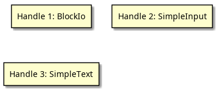
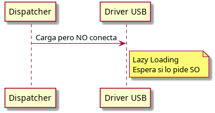

# Interfaz de Firmware Extensible Unificada (UEFI) 

## 📖 Marco Teórico

### ¿Qué es UEFI y por qué reemplaza a BIOS?

El BIOS antiguo tenía limitaciones serias: era código de **16 bits**, solo accedía a **1 MB de memoria**, y dependía de hardware heredado de los años 80 (como chips timer 8254 y controladores de interrupciones 8259). Era lento y difícil de actualizar.

**UEFI** (Unified Extensible Firmware Interface) llegó para reemplazarlo. Es una interfaz moderna que soporta **32 y 64 bits**, accede a toda la memoria, y funciona con hardware actual (USB, SATA, NVMe, etc.). Lo importante: **UEFI es la especificación** (las reglas de cómo debe funcionar).

Pero hay un concepto diferente:

#### UEFI vs PI: ¿Cuál es la diferencia?

- **UEFI**: Son las APIs, la interfaz que usa el sistema operativo. Es lo que ves, el "contrato" que el firmware promete cumplir.
- **PI (Platform Initialization)**: Es la **arquitectura interna** del firmware. Define cómo se construye todo desde que enciendes la PC hasta que carga Windows.

### Las 5 Fases: Cómo Arranca tu Computadora

Cuando enciendes tu PC. El firmware ejecuta **5 fases en orden**:

1. **SEC (Security)** - El primer segundo
   - El CPU no tiene acceso a RAM todavía
   - Se usa la **caché del CPU como RAM temporal** (Cache-as-RAM)
   - Se establece la "raíz de confianza" (base de toda la seguridad)

2. **PEI (Pre-EFI Initialization)** - 1-2 segundos
   - Se inicializa la RAM principal
   - Se detectan componentes críticos (controlador de memoria, chipset)
   - Se genera información que se pasa a la siguiente fase

3. **DXE (Driver Execution Environment)** - 5-8 segundos
   - Es la **fase más importante**. Se cargan todos los drivers
   - Cada driver se carga en el orden correcto (uno depende del otro)
   - Se crean abstracciones para USB, disco, pantalla, etc.

4. **BDS (Boot Device Selection)** - 1-2 segundos
   - Se decide **cuál sistema operativo cargar**
   - Se conectan periféricos (teclado, pantalla)
   - Se transfiere control al bootloader de Windows o Linux

5. **RT (Runtime)** - Después que carga el SO
   - El bootloader del SO llama a `ExitBootServices()`
   - Ya no hay acceso a firmware, pero quedan **Runtime Services** disponibles
   - El SO usa esos servicios para cosas como obtener la hora o reiniciar

### Las Estructuras de Datos: Cómo se Comunica Todo

El firmware necesita un **directorio** para que todos encuentren dónde ir.

#### 1. UEFI System Table

Es la **guía maestra**. Contiene dos cosas principales:

- **Boot Services**: Funciones disponibles **solo durante el arranque**
  - Pedir memoria (AllocatePool)
  - Crear alarmas/eventos (CreateEvent)
  - Cargar archivos (LoadImage)
  - Buscar drivers (LocateProtocol)

- **Runtime Services**: Funciones disponibles **antes y después** que carga el SO
  - Obtener la hora (GetTime)
  - Guardar variables de configuración (SetVariable)
  - Reiniciar la PC (ResetSystem)

#### 2. Handles y Protocolos: Cómo Descubrir Hardware

El firmware **abstrae todo como si fuera objetos**:

- **Handle**: Un identificador para **cualquier cosa** (un disco, un puerto USB, una impresora conectada)
- **Protocolo**: Las **funciones disponibles** de ese Handle
  - Ejemplo: BlockIo Protocol = leer/escribir un disco
  - Ejemplo: SimpleInput Protocol = leer del teclado

**¿Cómo funciona?** Tu programa busca un protocolo mediante un **GUID** (un número único global). Si existe, puedes usar sus funciones.

### El Truco Inteligente: Lazy Loading

Los drivers son listos: no hacen trabajo innecesario.

- **Se cargan todos los drivers** en la fase DXE
- **Pero solo se "conectan" si se necesitan**
  - El driver USB se carga pero no se inicializa si no hay nada enchufado
  - El driver de la impresora se carga pero la impresora no se enciende
- **Durante BDS**, el firmware solo **enciende lo que necesita** para encontrar el boot device (por ejemplo, el disco con Windows)
- El **resto de dispositivos se activan después**, a nivel del SO

**Resultado**: El arranque es **muy rápido** porque no esperamos a que se detecten todos los periféricos innecesarios.

### Seguridad: ¿Cómo Evitar que te Hackeen el Firmware?

El firmware verifica que el bootloader es legítimo:

1. Toma el archivo `.efi` (el bootloader de Windows)
2. Verifica su **firma digital** (como un certificado SSL)
3. Si la firma es válida → ejecuta
4. Si la firma es inválida o no está → bloquea

**Pero hay un riesgo importante:** El flujo **S3 Resume** (despertar de standby)

- En lugar de repetir las fases PEI y DXE (lento), guarda un "script" que reproduce las mismas operaciones
- Si un atacante modifica ese script, **puede ejecutar código malicioso muy temprano**
- Y el SO nunca se entera

Por eso: **la seguridad del firmware es crítica**.

### El Flujo Completo: De Cero a Windows

