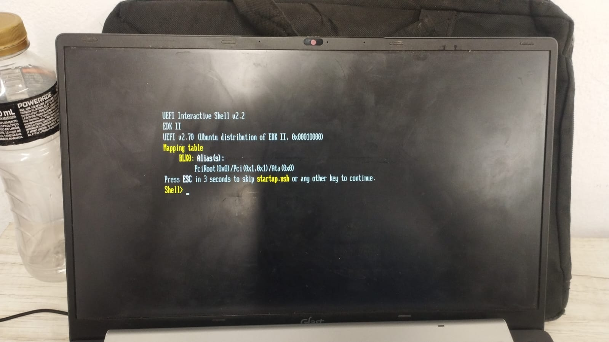
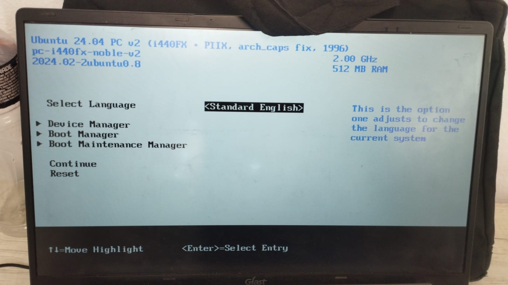
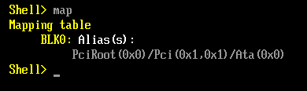
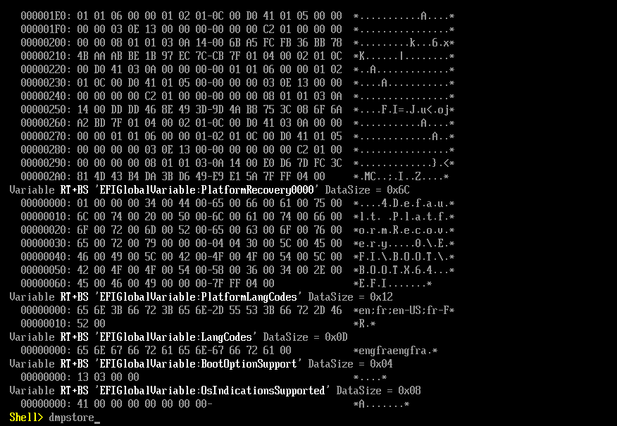
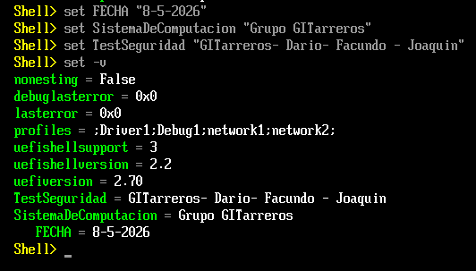

# 🔧 PARTE 2: TP1 - Exploración del Entorno UEFI y Shell

---
# Paso 2.1: Arrancar en QEMU con UEFI

```bash
qemu-system-x86_64 -m 512 -bios /usr/share/ovmf/OVMF.fd -net none
```


| Parámetro | Qué hace |
|-----------|----------|
| `qemu-system-x86_64` | Emula una PC x86 de 64 bits |
| `-m 512` | Asigna 512 MB de RAM a la máquina virtual |
| `-bios /usr/share/ovmf/OVMF.fd` | Usa OVMF como firmware (la UEFI virtual) |
| `-net none` | Sin red (evita complejidades) |

**Si QEMU no encuentra OVMF.fd:**
```bash
find /usr/share -iname "OVMF.fd"
# Luego reemplazo la ruta en anterior comando
```


**Para cerrar:** `Ctrl + Alt + Q` o en la Shell: `exit`

**Para salir pantalla completa:** `Ctrl + Alt + F`
---


# Paso 2.2: Exploración de Dispositivos (Handles y Protocolos)

Una vez en la Shell, vamos a ver **qué hardware detectó UEFI**.

**Comando 1: Ver qué discos/sistemas de archivos**
```
Shell> map
```



**Ver TODOS los Handles y sus Protocolos**
```
Shell> dh -b
```


**¿Qué ves?** Una lista de todos los Handles del sistema:
```
Handle  Protocols
======  =========
1       LoadedImage
2       DevicePath, BlockIo
3       SimpleFileSystem, BlockIo
...
```

Cada número es un "Handle" (una cosa en el sistema).
Cada cosa bajo "Protocols" es una **interfaz** que esa cosa soporta.

- **BlockIo** = puedo leer/escribir bloques de datos (disco)
- **SimpleFileSystem** = puedo leer archivos
- **DevicePath** = puedo saber dónde está este dispositivo en el árbol de hardware

## ❓ Pregunta de Razonamiento 1

**"Al ejecutar `map` y `dh`, vemos protocolos e identificadores en lugar de puertos de hardware fijos. ¿Cuál es la ventaja de seguridad y compatibilidad de este modelo frente al antiguo BIOS?"**

***Rta:***

El BIOS antiguo asumía que el hardware estaba en lugares fijos:
- Disco duro siempre en "A:", "C:"
- Puertos seriales en puertos específicos

Con UEFI/Handles:
- El firmware **descubre dinámicamente** qué hardware hay
- No importa el orden de encendido o cableado
- **Seguridad:** El firmware abstrae el hardware, el SO no accede directamente (mejor control)
- **Compatibilidad:** Funciona con cualquier hardware, no está "hardcodeado"

---


# Paso 2.3: Análisis de Variables Globales (NVRAM)

UEFI guarda configuración en **NVRAM** (memoria no volátil). Cuando apagas la PC, esos datos permanecen.

**Comando 1: Ver todas las variables**
```
Shell> dmpstore
```


Esto se ve como basura binaria porque las variables están **en formato binario**, no texto.


**Comando 2: Crear tu propia variable de prueba**
```
Shell> set TestSeguridad "GITarreros - Dario - Facundo - Joaquin"
```

**Comando 3: Listar solo variables de texto**
```
Shell> set -v
```


Vemos todas las variables que están en formato texto.


#### ❓ Pregunta de Razonamiento 2

**"Observando las variables `Boot####` y `BootOrder`, ¿cómo determina el Boot Manager la secuencia de arranque?"**

**Respuesta esperada:**

1. **BootOrder** es una lista ordenada de números (ejemplo: `00 01 02`)
2. **Boot0000**, **Boot0001**, **Boot0002** contienen información sobre dónde cargar cada sistema operativo
3. El Boot Manager lee **BootOrder** en orden, luego busca cada variable Boot###
4. Por ejemplo:
   - BootOrder = `00 01 02`
   - Intenta Boot0000 (disco C:)
   - Si falla, intenta Boot0001 (pendrive)
   - Si falla, intenta Boot0002 (red)

**Riesgo de seguridad:** Si un atacante modifica BootOrder o Boot0000, puede hacer que cargue SO falso o bootkit malicioso.

---

### Paso 2.4: Footprinting de Memoria y Hardware

Ahora vamos a inspeccionar **dónde está todo en memoria**.

**Comando 1: Ver mapa de memoria**
```
Shell> memmap -b
```


Las líneas importantes son:
- **LoaderCode**: Código que ya se ejecutó (bootloader, firmware early)
- **RuntimeServicesCode**: Código que **permanece en memoria después de que carga el SO**
- **Reserved**: Memoria reservada por el hardware


**Comando 2: Ver configuración PCI (buses, tarjetas)**
```
Shell> pci -b
```


Cada línea es un dispositivo PCI (GPU, tarjeta de red, USB host, etc.).


**Comando 3: Ver drivers cargados**
```
Shell> drivers -b
```


**¿Qué ves?** Los drivers UEFI activos en el sistema.

#### ❓ Pregunta de Razonamiento 3

**"En el mapa de memoria (memmap), existen regiones marcadas como `RuntimeServicesCode`. ¿Por qué estas áreas son un objetivo principal para los desarrolladores de malware (Bootkits)?"**

**Rta:**

1. **RuntimeServicesCode permanece en memoria durante toda la ejecución del SO**
   - Mientras Linux o Windows corre, el firmware sigue en memoria
   - Si un malware la corrompe, afecta a todo el sistema

2. **El SO tiene poco control sobre RuntimeServices**
   - El SO no puede limpiar ni auditar el código del firmware
   - Si es malicioso, es casi invisible

3. **Acceso al hardware directo**
   - RuntimeServicesCode puede acceder a dispositivos de I/O directamente
   - Puede interceptar teclado, pantalla, red sin que el SO se entere

4. **Persistencia**
   - Si un bootkit infecta RuntimeServicesCode, **sobrevive a reinstalar el SO**
   - Reiniciar tampoco lo elimina (está en NVRAM o en la ROM del firmware)

**Ejemplo:** El bootkit Hacking Team UEFI (2015) infectaba exactamente RuntimeServicesCode para spywear.

---
