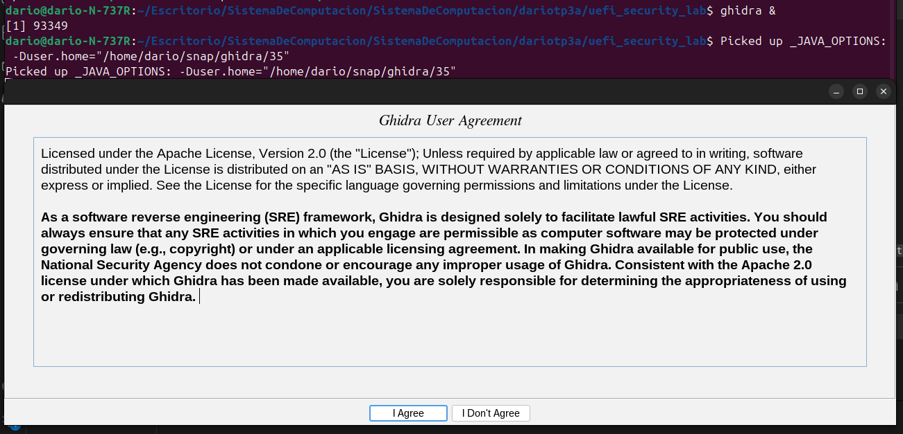
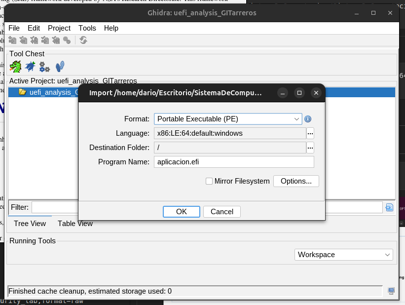
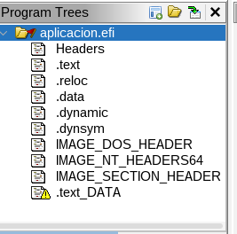
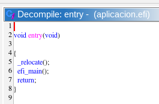
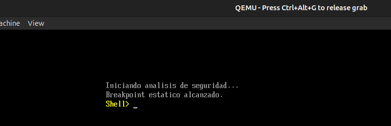

# 🔨 TP2: Desarrollo, Compilación y Análisis de Aplicación UEFI

## 🎯 Objetivo

Crear una aplicación nativa UEFI en C, compilarla a formato PE/COFF, y analizarla con Ghidra.

---

# 2.1 Crear el archivo C

```c
#include <efi.h>
#include <efilib.h>

EFI_STATUS EFIAPI efi_main(EFI_HANDLE ImageHandle, EFI_SYSTEM_TABLE *SystemTable) {
  volatile unsigned char code[] = {
    0xCC
  };
  
  uefi_call_wrapper(SystemTable->ConOut->ClearScreen, 1, SystemTable->ConOut);
  
  uefi_call_wrapper(SystemTable->ConOut->OutputString, 2, SystemTable->ConOut,
    L"Iniciando analisis de seguridad...\r\n");
  
  if (code[0] == 0xCC) {
    uefi_call_wrapper(SystemTable->ConOut->OutputString, 2, SystemTable->ConOut,
      L"Breakpoint estatico alcanzado.\r\n");
  }
  
  uefi_call_wrapper(SystemTable->BootServices->Stall, 1, 5000000);
  
  return EFI_SUCCESS;
}
```
### ***Pregunta de Razonamiento 4:***
¿Por qué utilizamos ***SystemTable->ConOut->OutputString*** en lugar de la función printf de C?

Rta:

Porque en UEFI no existe la librería C estándar (libc).
printf depende de libc (librería C):
```c
printf("Hola");
// Internamente:
// 1. Busca la syscall write() del SO
// 2. Envía el string al kernel
// 3. El kernel escribe en pantalla
```
En UEFI no hay SO todavía, así que printf no funciona:

- No hay kernel
- No hay syscalls
- No hay libc instalada

---

# 2.2: Compilación a Formato PE/COFF

## Compilar a código objeto

```bash
gcc -I/usr/include/efi -I/usr/include/efi/x86_64 -I/usr/include/efi/protocol \
  -fpic -ffreestanding -fno-stack-protector -fno-strict-aliasing -fshort-wchar \
  -mno-red-zone -maccumulate-outgoing-args -Wall -c -o aplicacion.o aplicacion.c
```

- `-I/usr/include/efi` = Donde están los headers de UEFI
- `-fpic` = Código independiente de posición (para firmware)
- `-ffreestanding` = No asume libc estándar
- `-c` = Solo compilar, no linkear
- `-o aplicacion.o` = Crear archivo objeto


---

##  Linkear (crear .so intermedio)

```bash
ld -shared -Bsymbolic -L/usr/lib -L/usr/lib/efi \
  -T /usr/lib/elf_x86_64_efi.lds /usr/lib/crt0-efi-x86_64.o aplicacion.o \
  -o aplicacion.so -lefi -lgnuefi
```


---

##  Convertir a EFI (PE/COFF)

```bash
objcopy -j .text -j .sdata -j .data -j .dynamic -j .dynsym -j .rel -j .rela \
  -j .rel.* -j .rela.* -j .reloc --target=efi-app-x86_64 \
  aplicacion.so aplicacion.efi
```


---

# 2.3: Análisis de Metadatos y Decompilación

```bash
dario@dario-N-737R:~/Escritorio/SistemaDeComputacion/SistemaDeComputacion/dariotp3a/uefi_security_lab$ file aplicacion.efi
```
Resultado:
```
aplicacion.efi: PE32+ executable (EFI application) x86-64 (stripped to external PDB), for MS Windows, 5 sections
```


**Tenemos el ejecutable UEFI real.**

---

## Analizar con Ghidra

```bash
ghidra &
```



En Ghidra:
1. **File** → **New Project**
2. Elige carpeta: `uefi_security_lab`
3. Nombre: `uefi_analysis`


4. **File** → **Import File**
5. Selecciona `aplicacion.efi`

luego doble click en aplicacion.efi


6. Clickea en la lista y presiona **Analyze**
7. En el árbol izquierdo, busca: **efi_main**
8. Doble-click para ver el código descompilado




---

# 2.4:  Ejecutar aplicacion.efi en QEMU


```bash
qemu-system-x86_64 -m 512 \
  -bios /usr/share/ovmf/OVMF.fd \
  -net none \
  -drive file=fat:rw:$HOME/uefi_security_lab,format=raw
```

Cuando QEMU arranque, presiona **Esc** para entrar a Shell.

```
Shell> map
```
Finalmente, ejecuta tu app:
```
FS0:\> aplicacion.efi
```



---
