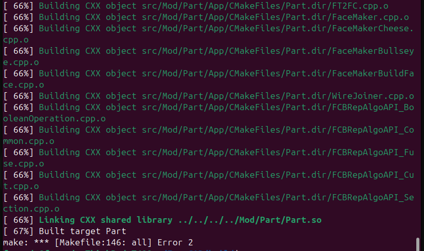

Checkinstall es una herramienta que rastrea los archivos instalados durante su compilacion del codigo fuente y genera un paquete .deb o .rpm con el objetivo de poder instalar o desinstalar el software por medio del gestor de paquetes de nuestro sistema. Esta herramienta a paquetes Slackware, Debian o RPM. Para poder utilizarlo se debe crear un ./configure antes de compilar el codigo con, por ejemplo, make, luego utilizando sudo checkinstall, se encargara del empaquetado e instalacion del programa. Podemos comprobar su funcionamiento con el siguiente ejemplo para instalar FreeCad:

1 instalacion checkinstall:
    sudo apt install checkinstall build-essential cmake git

2 descarga de dependencias necesarias para FreeCad:
    sudo add-apt-repository --enable-source ppa:freecad-maintainers/freecad-stable
    sudo apt update
    sudo apt build-dep freecad

3 Clonado del repositorio de FreeCad:
    git clone --depth 1 https://github.com/FreeCAD/FreeCAD.git
    cd FreeCAD

4 Configuracion y compilacion:
    una vez en la carpeta de FreeCAD realizamos lo siguiente:
        mkdir build
        cd build
        cmake ..

en el caso de proyectos tan grandes como este es muy probable que nos encontremos con multiples dificultades a la hora de compilar el programa, asi como dependencias y configuraciones. El proceso de compilacion luego de configurar el proyecto con cmake se hizo con make -j$(nproc) que utiliza todos los nucleos del dispositivo para llevarlo a cabo. Aun asi este proceso para projectos de tal tamaño puede llevar mucho tiempo y contar con multiples errores. Es por esto que no se llevara a cabo en su totalidad lastimosamente para este trabajo, al estar fuera del scope de tiempo el arreglar los errores encontrados.

En caso de haber llevado a cabo esta compilacion exitosamente podriamos haber instalado el programa utilizando:
sudo checkinstall

que se podra ver en otros casos de uso en este trabajo.