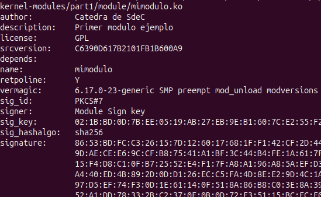

Kernel Modules

Para este proyecto es necesario contar con los headers de linux instalados, para lo cual se utiliza el siguiente comando

sudo apt-get install build-essential checkinstall linux-source linux-headers-$(uname -r)

donde el uso de $(uname -r) nos asegura que se instalen los headers correspondientes al kernel de linux instalado en nuestro sistema.

A la hora de generar modulos de kernel es necesario que realicemos una escritura adecuada de las syscalls para que el compilador pueda comunicar de manera adecuada los atributos insertados, esto lo podemos verificar mediante el uso de los headers. Lo Headers tienen informacion sobre las funciones existentes en el kernel, los parametros que reciben y los tipos de datos que devuelven. De esta forma evitamos tener que descargar la totalidad de funciones y en su lugar le damos una estructura con la que puede comunicarse nuestro modulo con el kernel de linux que tengamos instalado. 

El modulo a generar se obtendra a partir de los archivos presentes en el siguiente repositorio:

https://gitlab.com/sistemas-de-computacion-unc/kenel-modules.git

Del cual hacemos un fork en:

https://gitlab.com/facumartinez431/kernel-modules

En este podemos encontrar un archivo MakeFile que al ser corrido realiza las siguientes tareas:

- obj-m +=  mimodulo.o : declara "mimodulo.o" como un objeto de kernel modules a buildear
    
- all:
	make -C /lib/modules/$(shell uname -r)/build M=$(PWD) modules :
    - corre el kernel build system en /lib/modules/$(uname -r)/build. En este paso se utilizan los headers instalados previamente asi como la configuracion del kernel instalado en nuestro sistema. 
    - buildea el modulo dentro de la ubicacion actual a partir de mimodulo.c

- clean:
	make -C /lib/modules/$(shell uname -r)/build M=$(PWD) clean :
    - borra los archivos de modulo generado al correr el kernel build system usando "clean" limpiando el directorio de trabajo

el "clean" solo corre si lo llamamos por medio de comando dentro del directorio de trabajo: make clean

si intentamos insertar el modulo generado utilizando el siguiente comando:
- sudo insmod mimodulo.ko
es muy probable que nos figure el siguiente mensaje:
-  insmod: ERROR: could not insert module mimodulo.ko: Key was rejected by service
dado que nuestro sistema cuenta con secure boot habilitado por lo que no nos permite insertar modulos de kerner sin firmar

podemos verificar que el secure boot esta habilitado usando:
sudo mokutil --sb-state
en este caso obtenemos:
SecureBoot enabled

por lo cual si revisamos el buffer de kernel por medio de dmesg podremos ver un mensaje similar al siguiente:

[ 4035.412720] Loading of unsigned module is rejected

para esto podemos generar la firma de nuestro modulo. Tomando por ejemplo RHEL 8 podemos generar firmas openssl para añadirlas al llavero del sistema (.builtin_trusted_keys), generando una llave del propietario de la maquina (MOK). En el caso de Ubuntu (distro de la maquina utilizada) el proceso fue el siguiente:

- se genera un par de claves MOK (publica y privada) por medio del siguiente comando:
    openssl req -new -x509 -newkey rsa:2048 -keyout MOK.priv \
  -outform DER -out MOK.der -nodes -days 3650 \
  -subj "/CN=Module Sign key/"

siendo la clave privada la utilizada para firmar el modulo de kernel, mientras que la publica es la que se agregara al la base de claves confiables.

- se firma el modulo por edio del siguiente comando:
    sudo /lib/modules/$(uname -r)/build/scripts/sign-file sha256 MOK.priv MOK.der mimodulo.ko

- Importamos la clave publica para cargarla al MOK usando:
    sudo mokutil --import MOK.der

Una vez realizado este proceso es necesario reiniciar el sistema para poder efectuar la carga de la clave publica a .builtin_trusted_keys. Esto nos llevara por defecto a un menu de carga de claves MOK antes del inicio del sistema. El menu nos da una cuenta regresiva para seleccionar alguna de las opciones antes de saltar la carga de claves una vez terminado el tiempo.

Realizados estos pasos podemos volver a intentar insertar mimodulo.ko, esta vez no obtendremos mensaje de ningun tipo por lo que debemos utilizar dmesg para revisar que se haya cargado con exito:
$ sudo dmesg | tail -n 50
[  195.973677] mimodulo: loading out-of-tree module taints kernel.
[  195.974076] Modulo cargado en el kernel.

tambien podemos revisar datos del modulo cargado, asi como tamaño, usos/referencias, dependencias, estado, direccion de carga y banderas adicionales usando:

cat /proc/modules  | grep mod

con lo que obtenemos:

mimodulo 12288 0 - Live 0x0000000000000000 (O)

que la direccion de memoria en la que se cargo tenga su campo lleno de 0s no significa que se haya cargado en ese espacio de memoria necesariamente, sino que es probable que nuestro kernel no nos de acceso a esta por cuestiones de seguridad. Podemos bypassear esto utilizando sudo + el comando:
mimodulo 12288 0 - Live 0xffffffffc1c83000 (O)

ahora podemos remover el modulo usando:

sudo rmmod mimodulo

[ 2480.004281] Modulo descargado del kernel.

podemos ver informacion de nuestro modulo por medio del comando:
modinfo mimodulo.ko

En el cual podemos ver author, descripcion, licencia, llave de firma y llave. Si esto lo comparamos con otro modulo del kernel como por ejemplo des_generic:
modinfo des_generic

podemos ver algunas diferencias en los campos de informacion mostrados, como la precencia de aliases por ejemplo. pero de mayor importancia podemos ver que el algoritmo de firma del modulo es diferente, siendo que genera un hash sha512 a diferencia del generado por nosotros (sha256). Esta firma es una perteneciente a las .builtin_system_keys pertenecientes al kernel. 

Podemos generar una lista de modulos de kernel instalados en nuestro sistema usando el comando lsmod, en este caso se cargara la salida del mismo dentro de Modules_Facu.txt (sudo lsmod > .../Modules_Facu.txt)

Si queremos podemos revisar la totalidad de modulos compilados y guardados al momento de instalar nuestro kernel de linux. Los que se reviso en la seccion anterior son unicamente los que fueron cargados por el kernel al momento de iniciar el sistema por medio de udev, gestor que revisa el hardware disponible y carga los drivers correspondientes que matcheen con este. Asi como tenemos modulos (o drivers) cargados tambien contamos con una amplia variedad de otros que no lo fueron pero estan disponibles en caso de que el sistema cuente con el hardware correspondiente. Esto ultimo lo podemos revisar usando el siguiente comando:

comm -23 <(find /lib/modules/$(uname -r) -type f -name '*.ko*' -exec basename {} \; | sed -e 's/\.ko.*//' -e 's/-/_/g' | sort -u) <(lsmod | awk 'NR>1 {print $1}' | sed 's/-/_/g' | sort -u) > ../../../GITarreros/tp4/Not_installed.txt 

En caso de que un dispositivo no cuente con drivers disponibles, no sera reconocido por el sistema por lo que no podriamos darle uso. Es posible instalar nuevos modulos de kernel en caso de que no esten disponibles por default, ya sea porque son drivers para hardware muy especifico que hizo un individuo u organizacion y dejo open source, no estan disponibles en la version de kernel actual pero son integrados en otras actualizaciones o son drivers de codigo cerrado como es el caso de las placas NVidia. En el caso de Windows se puede utilizar drivers genericos que traducen el funcionamiento del dispositivo, mientras que en linux se necesita de los drivers especificos para lograrlo.

Los modulos de kernel cuentan con privilegios de ejecucion mas alto que los programas de usuario y tienen potencialmente mayor impacto sobre el sistema. Esto nos lleva a pensar en la importancia del uso de firmas para la verificacion de autenticidad del modulo de kernel. Existen multiples formas de realizar firmas, en el caso de este trabajo se hizo una firma por medio del protocolo openssl, este metodo es el utilizado para verificacion del kernel de linux en distros como RHEL, Ubuntu, etc. Pero tambien existen otros metodos de firma de binarios ELF que no siguen esta estructura, algunas implican el uso de un archivo por separado al que sera apuntado, otros generan una seccion nueva del fileSystem del binario donde se guarda la clave y otros agregan la firma al final del binario. 

Aparte de contar con un nivel de privilegio mayor, los modulos de kernel son guardados en espacios de direcciones distintos a los de programas de usuario (kernel space y user space). Este espacio diferenciado es gestionado y protegido para que dos programas distintos no puedan acceder el uno al otro, dado que esto podria generar errores en el funcionamiento de los mismos, asi como generar vulnerabilidades que un programa malicioso pueda exploitear. Es de gran importancia tambien el uso de espacios diferenciados para modulos de kernel dado que estos cuentan con alto privilegio en el sistema por lo que se podrian lleva a cavo ataques a nivel de kernel. Aparte de estar en espacios de memoria distintos tambien cuentan con funcionalidades distintas. En el caso de un programa de usuario podemos ver: interfaz del usuario (aunque no necesariamente), gestion de ciclo de vida del programa, manejo de tareas (gestion de ventanas, archivos, input del usuario y output del programa). Mientras que en modulos de kernel: pueden ser de carga automatica en el momento de insertar un dispositivo externo por usb, es decir que tienen la funcion de extender el funcionamiento del sistema, cuentan con funciones de API a las que llaman los programas de usuario, por lo que pueden ser utilizados por multiples aplicaciones. Los modulos no son vistos por el usuario y usualmente uno se abstrae del hecho de que los estan utilizando, esto se debe a que en su mayoria estos drivers son accedidos por los programas de usuario en si, lo cual nos permite el uso correcto de nuestro sistema.

Como hablamos anteriormente Los modulos cargados en nuestro sistema lo son a partir del hardware presente en el sistema al momento de arranque, podemos verificar el harware disponible utilizando hwinfo:
sudo apt install hwinfo
Podemos ver uno de los dispositivo utilizados por nuestro grupo en "HardwareInfo.txt" como ejemplo.

