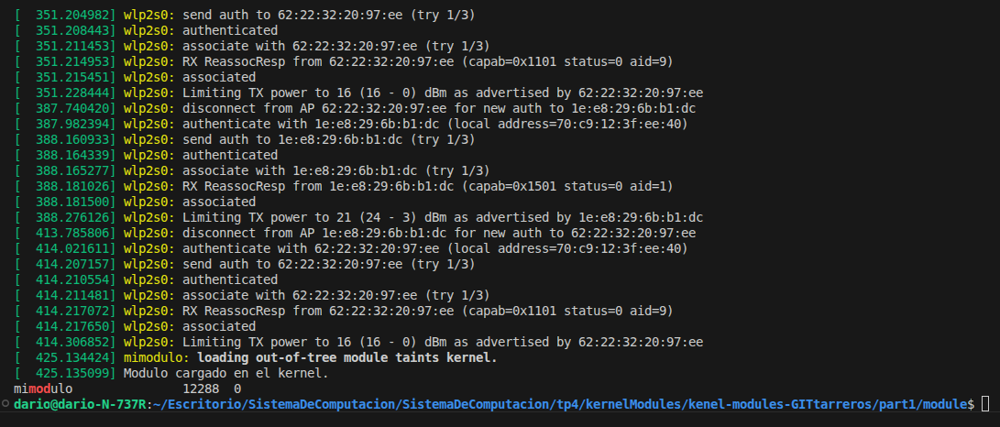
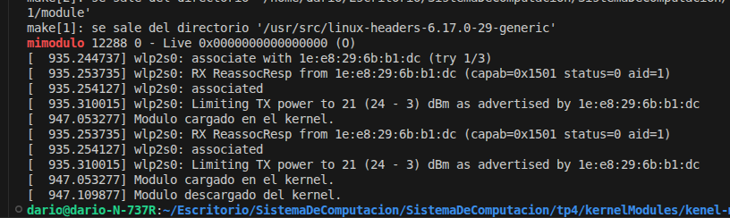
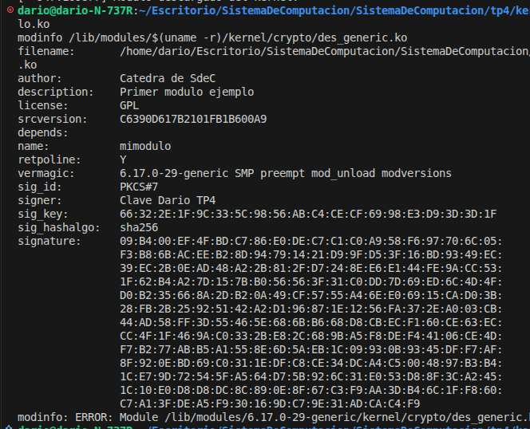
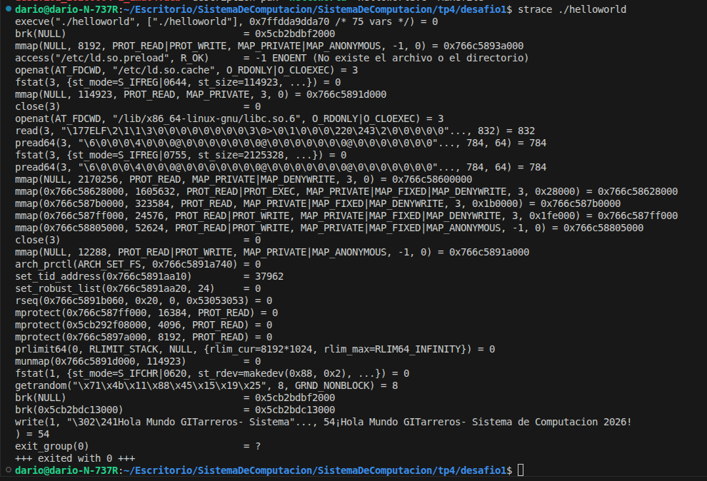
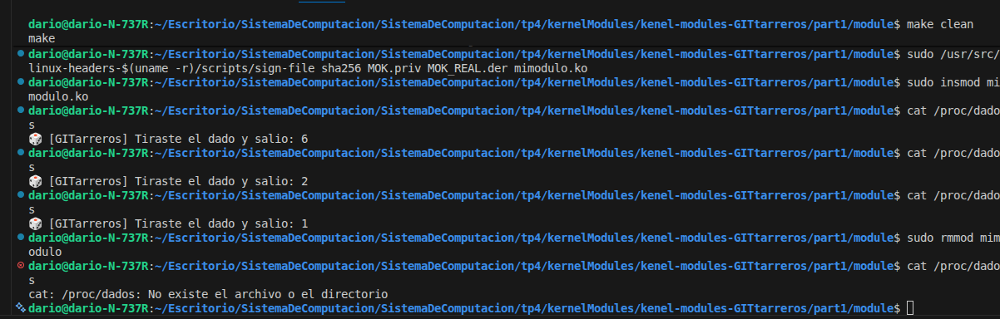

# tp4: Modulos de Kernel

- Primer paso fork repositorio de catedra:
```
git clone https://gitlab.com/dariocastillo11/kenel-modules-GITtarreros.git
```
- Instalacion de paquetes necesarios:
```
sudo apt-get install build-essential checkinstall kernel-package linux-source
```

El paquete kernel-package esta obsoleto asi que pruebo con modulos de kernel de versiones mas recientes:


```
sudo apt-get update
sudo apt-get install -y build-essential linux-headers-$(uname -r)
```

- **build-essential:** GCC, Make, compilador C

- **linux-headers -*:** Headers del kernel actual (necesario para módulos)


--- 

# Desafío #1 

Cuando compilamos un programa desde el código fuente (make && sudo make install), los archivos se copian directamente en el sistema (/usr/local/bin, etc.). El gran problema es que el gestor de paquetes de tu distribución (como apt o dpkg) no se entera de la existencia de estos archivos, lo que dificulta enormemente desinstalarlos o actualizarlos limpiamente. Para esto se utiliza la herramienta **checkinstall**.

### **checkinstall** 
Reemplaza a "sudo make install". Lo que hace es monitorear qué archivos se instalan mediante el Makefile. Crea un paquete nativo (un archivo **.deb** en Ubuntu/Debian).
Instalarlo a través del gestor oficial del sistema.
De esta forma, si queremos borrar el programa en el futuro, basta con ejecutar sudo apt remove <nombre>.


---
- Creo archivo [helloworld.c](/tp4/desafio1/helloworld.c) de ejemplo:

```c
#include <stdio.h>

int main() {
    printf("¡Hola Mundo GITarreros- Sistema de Computacion 2026!\n");
    return 0;
}
```

- Creo [Makefile](/tp4/desafio1/Makefile):
```Makefile
# Variables
CC = gcc
CFLAGS = -Wall -Werror
TARGET = helloworld
PREFIX = /usr/local

# Compilar el binario
all: $(TARGET)

$(TARGET): helloworld.c
	$(CC) $(CFLAGS) -o $(TARGET) helloworld.c

# Instalación: Indica dónde se copiará el binario en el sistema
install: $(TARGET)
	install -D -m 755 $(TARGET) $(DESTDIR)$(PREFIX)/bin/$(TARGET)

# Limpieza
clean:
	rm -f $(TARGET)
```
- Siguientes pasos:
```
make
sudo checkinstall
```
---
- Evidencia:
```
dario@dario-N-737R:~/Escritorio/SistemaDeComputacion/SistemaDeComputacion/tp4/desafio1$ sudo checkinstall

checkinstall 1.6.3, Copyright 2010 Felipe Eduardo Sanchez Diaz Duran
           Este software es distribuído de acuerdo a la GNU GPL


The package documentation directory ./doc-pak does not exist. 
Should I create a default set of package docs?  [y]: y

Preparando la documentación del paquete...OK

*** No known documentation files were found. The new package 
*** won't include a documentation directory.

Por favor escribe una descripción para el paquete.
Termina tu descripcion con una linea vacia o con EOF.
>> Guia tp4- sistema de computacion - GITarreros:
>> 

*****************************************
**** Debian package creation selected ***
*****************************************

Este paquete será creado de acuerdo a estos valores:

0 -  Maintainer: [ root@dario-N-737R ]
1 -  Summary: [ Guia tp4- sistema de computacion - GITarreros: ]
2 -  Name:    [ desafio1 ]
3 -  Version: [ 20260604 ]
4 -  Release: [ 1 ]
5 -  License: [ GPL ]
6 -  Group:   [ checkinstall ]
7 -  Architecture: [ amd64 ]
8 -  Source location: [ desafio1 ]
9 -  Alternate source location: [  ]
10 - Requires: [  ]
11 - Recommends: [  ]
12 - Suggests: [  ]
13 - Provides: [ desafio1 ]
14 - Conflicts: [  ]
15 - Replaces: [  ]
16 - Prerequires: [  ]

Introduce un número para cambiar algún dato u oprime ENTER para continuar:2
Introduce el nuevo nombre:
```


- Comprobamos si nuestro sistema de paquetes lo reconoce:
```
dpkg -l | grep desafio1
```
- Resultado:
```

dario@dario-N-737R:~/Escritorio/SistemaDeComputacion/SistemaDeComputacion/tp4/desafio1$ dpkg -l | grep desafio1
ii  desafio1                                       20260604-1                               amd64        Guia tp4- sistema de computacion - GITarreros:
```


---


- Luego si ejecutamos nuestro programa desde cualquier ruta nuestro gestor de paquetes lo buscara y ejecutara :

```
dario@dario-N-737R:~/Escritorio/SistemaDeComputacion/dario@dario-N-737R:~$ helloworld
¡Hola Mundo GITarreros- Sistema de Computacion 2026!
```
---
- En caso de eliminar desistalarlo simplemente:

```
dario@dario-N-737R:~$ sudo apt remove desafio1
Leyendo lista de paquetes... Hecho
Creando árbol de dependencias... Hecho
Leyendo la información de estado... Hecho
Los paquetes indicados a continuación se instalaron de forma automática y ya no son necesarios.
  libllvm19 libllvm19:i386 libxcb-dri2-0:i386 steam-libs:i386
Utilice «sudo apt autoremove» para eliminarlos.
Los siguientes paquetes se ELIMINARÁN:
  desafio1
0 actualizados, 0 nuevos se instalarán, 1 para eliminar y 263 no actualizados.
Se liberarán 36,9 kB después de esta operación.
¿Desea continuar? [S/n] s
(Leyendo la base de datos ... 282771 ficheros o directorios instalados actualmen
te.)
Desinstalando desafio1 (20260604-1) ...
dpkg: atención: al desinstalar desafio1, el directorio «/usr/local/bin» no está 
vacío, por lo que no se borra
dario@dario-N-737R:~$ helloworld
bash: /usr/local/bin/helloworld: No existe el archivo o el directorio
dario@dario-N-737R:~$ 
```

### Seguridad del Kernel: Evitando módulos no firmados (Rootkits)

Un rootkit LKM (Loadable Kernel Module) funciona interceptando las tablas del sistema. Por ejemplo, modifica la llamada al sistema sys_getdents (que lee el contenido de los directorios) para que, cuando el usuario ejecute ls, el kernel oculte mágicamente la carpeta donde está el malware.

Para mitigar esto en entornos de alta seguridad, se configura el kernel con la opción de endurecimiento (hardening):
```
CONFIG_MODULE_SIG_FORCE=y 
```

Si esta opción está activa en la compilación del kernel, el sistema rechazará categóricamente la carga de cualquier módulo mediante insmod o modprobe que no cuente con una firma criptográfica válida y verificable por una clave pública de confianza del sistema. Ya no mostrará un simple aviso (tainted kernel), sino un error de operación denegada (Permission denied).

---
---
---

# Desafío #2
Debe tener respuestas precisas a las siguientes preguntas y sentencias:
### **¿Qué funciones tiene disponible un programa y un módulo ?**

Tabla de Funciones y API Disponibles
- **Programa** (Espacio de Usuario): Se enlaza dinámicamente con la Biblioteca Estándar de C (libc.so). Cuando usas printf(), esta función internamente acomoda los registros del procesador y ejecuta una instrucción especial de hardware (como syscall o int 0x80) para cederle el control al kernel.

- **Módulo** (Espacio de Kernel): No tiene acceso a libc.so. Si intentas incluir <stdio.h>, el módulo no compilará o fallará catastróficamente. En su lugar, el kernel expone su propia API interna. Para imprimir en el registro del sistema se utiliza exclusivamente printk() (o macros más modernas como pr_info()).


## **Espacio de usuario o espacio del kernel.**

**Espacio de datos.**

 Espacio de Usuario vs. Espacio de Kernel (Datos y Memoria)
La memoria en Linux se divide estrictamente gracias a la MMU (Unidad de Gestión de Memoria) del procesador:

- **Espacio de Usuario:** Cada proceso cree que tiene el control total de la memoria porque opera en un espacio de direcciones virtuales aislado. El proceso A no puede leer ni escribir en la memoria del proceso B.

- **Espacio de Kernel:** Todos los módulos del kernel comparten el mismo espacio de direcciones virtuales y físicas. No hay aislamiento entre ellos. Si tu módulo escribe por error en un puntero salvaje, podría estar sobrescribiendo las estructuras de datos de la pila de red, el sistema de archivos (ext4) o las tablas de páginas del procesador, congelando la máquina al instante.


## **Drivers. Investigar contenido de /dev.**

**Drivers:** Investigando el contenido de /dev
Si ejecutas de forma detallada ls -l /dev, verás algo como esto:


```Plaintext
crw-rw-rw-  1 root root      1,   3 jun  4 15:00 /dev/null
crw-rw----  1 root dialout   4,  64 jun  4 15:00 /dev/ttyS0
brw-rw----  1 root disk      8,   0 jun  4 15:00 /dev/sda
```
- **c o b:** El primer carácter indica si es un dispositivo de caracteres (c) como terminales o puertos serie, o de bloques (b) como discos duros y unidades de almacenamiento.

- **Major Number**(Primer número, ej: 1, 4, 8): Le dice al kernel qué driver específico debe manejar las peticiones de ese archivo. El Major 8 está reservado universalmente en Linux para el driver de discos SCSI/SATA.

- **Minor Number** (Segundo número, ej: 3, 64, 0): Le dice al driver qué dispositivo físico o partición exacta se está direccionando (por ejemplo, sda es el disco entero, sda1 tendrá otro minor number para la primera partición).


---
---
---

# Crear un MODULO:

## Pasos:

```
cd part1
cd module
make
```
- Compilar y generar el archivo mimodulo.ko
```
sudo insmod mimodulo.ko
```
- Error:
```textplane
insmod: ERROR: could not insert module mimodulo.ko: Key was rejected by service
```

El mensaje "Key was rejected by service" (Clave rechazada por el servicio) significa exactamente esto: Tienes el Secure Boot activado en tu BIOS/UEFI y tu kernel está configurado en modo estricto. El "servicio" es el subsistema de verificación de firmas del kernel de Linux, que al ver que tu módulo es casero y no está firmado por una clave autorizada (como la de Ubuntu), te cierra la puerta en la cara por protección.

## ¿Cómo solucionas el ERROR de inserción? (Elige un Camino)
Tienes dos opciones reales para destrabar tu TP en este momento. La Opción 1 es la más rápida para entornos de desarrollo/laboratorio. La Opción 2 es la correcta si quieres lucirte en el informe aplicando lo del Desafío #1.

## Opción 1: 
- Desactivar Temporalmente el Secure Boot (La rápida)
Dado que estás en tu máquina de desarrollo, puedes apagar la verificación estricta de hardware.

- Reinicia tu computadora y presiona repetidamente la tecla para entrar a la BIOS/UEFI (suele ser F2, F10, F12 o Del/Supr).

- Ve a la pestaña de Security (Seguridad) o Boot (Arranque).

- Buscar la opción Secure Boot y cámbiala de Enabled a Disabled.

- Guarda los cambios (F10) y arranca Ubuntu normalmente.

- Volver a intentar sudo insmod mimodulo.ko. Verás que ahora te dejará insertarlo (y si corres dmesg, verás el mensaje de tainting kernel que mencionaba la guía original, pero ya no se rechazará).

## Opción 2: 
Firmar el módulo (El camino del experto)
Si no quieres o no puedes tocar la BIOS de tu máquina, debes firmar el módulo con una clave en la que tu sistema confíe (lo que explicamos en el paso a paso del laboratorio del Desafío 1).

Ejecuta estos comandos rápidos en tu terminal para crear tu firma e inscribirla

- Crea la clave de firma:
```Bash
openssl req -new -x509 -newkey rsa:2048 -keyout MOK.priv -out MOK.der -nodes -days 365 -subj "/CN=Clave Dario TP4/"
```

- Inscribir la clave en el sistema (MOK):
```Bash
sudo mokutil --import MOK.der
```
Poner una contraseña fácil que recuerdes (ej: 12345678).

- Reinicia la PC: Al arrancar, te aparecerá una pantalla azul de la UEFI llamada Shim UEFI Key Management. Selecciona Enroll MOK, dale a Continue, dile que Sí (Yes), introduce la contraseña que inventaste y dale a Reboot.

- Firma tu archivo .ko: Al volver a entrar a Ubuntu, ve a la carpeta del módulo y fírmalo usando el script del kernel:


```Bash
sudo /usr/src/linux-headers-$(uname -r)/scripts/sign-file sha256 MOK.priv MOK.der mimodulo.ko
```

- Prueba final: Ejecuta sudo insmod mimodulo.ko. ¡Adiós error! El kernel validará que el módulo está firmado por la clave "Clave Dario TP4" que acabas de autorizar en la UEFI y te permitirá la ejecución en el acto.

---

```
sudo dmesg
lsmod | grep mod
```


```
sudo rmmod mimodulo
sudo dmesg
lsmod | grep mod

cat /proc/modules  | grep mod
```


- mimodulo 12288 0 - Live 0x0000000000000000 (O)


### Nos dice:

- 12288: Tu módulo pesa exactamente 12 KB en la memoria RAM.

- Live: Reconfirma que el módulo estaba activo y corriendo perfectamente en el Anillo 0.

- 0x0000000000000000: Curiosidad técnica: En kernels modernos (como tu versión 6.17), por motivos estrictos de seguridad para evitar ataques que apunten a direcciones fijas del sistema (mitigación llamada KASLR), el kernel suele ocultar la dirección de memoria real a usuarios que no son root puros (mostrando ceros), a menos que uses sudo cat /proc/modules.

- (O): Significa Out-of-tree. ¡Ya no sale la E que salía antes porque tu firma funcionó o el estado de verificación cambió!


```bash
modinfo mimodulo.ko 
modinfo /lib/modules/$(uname -r)/kernel/crypto/des_generic.ko
```



##  Análisis de tu mimodulo.ko (Firmado con Éxito)
Al ejecutar modinfo mimodulo.ko, el kernel te leyó los metadatos del archivo binario. Esto es oro puro para tu informe porque demuestra que completaste el Desafío #1 como un profesional:

- signer: Clave Dario TP4: ¡Ahí está! El kernel reconoce explícitamente el nombre (Common Name) que le diste a tu clave criptográfica durante el lab.

- sig_key: 66:32:2E...: Es la huella digital (thumbprint) de la clave pública que inscribiste con éxito en la UEFI (MOK).

- signature: 09:B4:00...: Todo ese bloque gigante de números hexadecimales es la firma digital criptográfica (PKCS#7). El script sign-file firmó el hash de tu código máquina con tu clave privada y lo incrustó al final del archivo .ko. Por eso tu kernel ahora lo acepta sin chistar.


---

# Cuestionario de Módulos del Kernel (TP4)

### 1. ¿Qué diferencias se pueden observar entre los dos `modinfo`?

Al comparar la salida de `modinfo mimodulo.ko` con la de un módulo oficial del sistema (como `modinfo psmouse` o cualquier driver nativo), se observan las siguientes diferencias estructurales:

* **Firma Criptográfica y Autoridad de Confianza:** El módulo del sistema cuenta con los campos `signer` apuntando a la entidad oficial de la distribución (ej. *Ubuntu Secure Boot Module Signing key*), junto con los campos `sig_key` y `signature`. Tu módulo local, antes de ser firmado por vos, carecía por completo de estos campos. Ahora que lo firmaste, muestra tu entidad local (*Clave Dario TP4*).
* **Ruta del Archivo (`filename`):** El módulo local apunta a tu directorio de desarrollo en el espacio de usuario (`/home/dario/...`), mientras que el del sistema reside en el árbol oficial de controladores del núcleo (`/lib/modules/$(uname -r)/...`).
* **Metadatos de Distribución:** Los controladores nativos suelen incluir campos extendidos como `alias` de hardware específicos (códigos numéricos que identifican con qué componentes físicos es compatible) y `depends` (módulos de los que depende para funcionar), mientras que tu módulo inicial es minimalista.

---

### 2. ¿Qué drivers/módulos están cargados en sus propias PC? Comparar las salidas con las computadoras de cada integrante del grupo. Expliquen las diferencias.

* **Por qué varían:** La salida del comando `lsmod` varía entre computadoras porque el kernel de Linux es modular y dinámico. Al arrancar el sistema, el demonio `udev` escanea el bus de hardware (PCI, USB, etc.), lee los identificadores de los dispositivos físicos reales presentes en la placa madre y carga en la RAM **únicamente los módulos específicos requeridos para controlar ese hardware**.
* **Ejemplo de diferencias para el informe:** Si tu compañero tiene un procesador AMD y placa de video dedicada Nvidia, su `lsmod` mostrará módulos como `kvm_amd` y `nvidia`. En cambio, si tu máquina posee un procesador Intel con gráficos integrados, tu salida mostrará `kvm_intel` e `i915`.
* **Instrucción del práctico:** Deben exportar la salida de cada integrante a un archivo de texto (`lsmod > dario.txt`), subirlos al repositorio Git y usar el comando de terminal `diff -u dario.txt compañero.txt` para generar la comparativa visual que solicita la cátedra para el reporte.

---

### 3. ¿Cuáles no están cargados pero están disponibles? ¿Qué pasa cuando el driver de un dispositivo no está disponible?

* **Módulos Disponibles vs Cargados:** Los módulos cargados están activos en la memoria RAM del sistema. Los módulos **disponibles** son todos aquellos archivos con extensión `.ko` compilados por la distribución que se encuentran almacenados en el disco duro bajo la ruta `/lib/modules/$(uname -r)/kernel/`. Hay miles de drivers disponibles esperando a ser llamados si se conecta el hardware correspondiente.
* **¿Qué pasa si el driver no está disponible?** Si conectas un hardware periférico (por ejemplo, una antena Wi-Fi USB genérica muy reciente) y el kernel no dispone del driver compatible en sus directorios, el dispositivo no funcionará. El hardware recibirá energía eléctrica del bus, pero el sistema operativo será incapaz de crear la interfaz de red o el archivo de dispositivo en `/dev` para interactuar con él; el componente quedará huérfano e inútil.

---

### 4. Correr `hwinfo` en una PC real con HW real y agregar la URL de la información de HW en el reporte.

Para resolver este punto, debés ejecutar en tu terminal:

```bash
sudo apt install hwinfo  # Si no lo tenés instalado
sudo hwinfo --short > mi_hardware.txt

```

[Info pc](https://gist.github.com/dariocastillo11/fb3207fea90ef988746cdb373c3e0442) 

[Info pc](/mi_hardware.txt)
---

### 5. ¿Qué diferencia existe entre un módulo y un programa?

Se diferencian fundamentalmente en su nivel de privilegio, gestión de memoria y ciclo de vida:

* **Punto de Entrada:** Un programa común de usuario inicia en la función `main()`, ejecuta sus instrucciones secuenciales y finaliza de forma autónoma. Un módulo no tiene `main()`; registra funciones de ciclo de vida (`module_init` y `module_exit`) que actúan como "manejadores de eventos" esperando a que el kernel o el hardware requieran sus servicios.
* **Espacio de Ejecución:** El programa corre en **Espacio de Usuario (Anillo 3)** con memoria virtual aislada y protegida por hardware. El módulo corre en **Espacio de Kernel (Anillo 0)**, lo que significa que tiene acceso directo e ilimitado a todo el hardware de la máquina, compartiendo el mismo mapa de memoria que el resto del núcleo.
* **Consecuencias de un fallo:** Si un programa falla (puntero a NULL), el sistema operativo lo mata de forma aislada (*Segmentation Fault*). Si un módulo del kernel tiene un puntero salvaje, corrompe la memoria del núcleo, provocando un congelamiento total del sistema (*Kernel Panic*).

---

### 6. ¿Cómo puede ver una lista de las llamadas al sistema que realiza un simple helloworld en C?

Se utiliza la herramienta de rastreo **`strace`**. Al ejecutar en la terminal:

```bash
strace ./helloworld

```


El programa interceptará y listará secuencialmente cada interacción entre el espacio de usuario y el espacio de kernel. Podrás observar llamadas como `execve()` (para ejecutar el binario), `brk()` o `mmap()` (para mapear la memoria y las bibliotecas como `libc.so`), y fundamentalmente la llamada **`write(1, "¡Hola Mundo...", ...)`**, que es la *syscall* real que el sistema operativo ejecuta para enviar los caracteres a la pantalla a través del descriptor de archivo de la salida estándar.

---

### 7. ¿Qué es un segmentation fault? ¿Cómo lo maneja el kernel y cómo lo hace un programa?

Un *Segmentation Fault* (Fallo de segmentación / `SIGSEGV`) ocurre cuando un hilo de ejecución intenta acceder a una dirección de memoria a la cual no tiene permisos de lectura o escritura (por ejemplo, desreferenciar un puntero `NULL` o escribir en una zona de código de solo lectura), violando las tablas de páginas configuradas en la MMU.

* **Manejo por parte del Kernel:** La MMU del procesador detecta la violación de hardware e interrumpe la CPU, cediéndole el control al kernel. El kernel identifica el proceso infractor, detiene su ejecución inmediatamente y le envía la señal `SIGSEGV`.
* **Manejo por parte del Programa:** Por defecto, los programas no capturan esta señal; al recibirla, el proceso muere de inmediato en la terminal y opcionalmente el sistema genera un volcado de memoria (*core dump*) para auditoría. Sin embargo, un programa puede registrar un manejador de señales personalizado mediante `sigaction()` para interceptar el error, guardar registros de última hora (logs) o cerrar conexiones de red de manera ordenada antes de finalizar forzosamente.

---

### 8. ¿Se animan a intentar firmar un módulo de kernel? Y documentar el proceso.

**¡Sí, resuelto con éxito!** (Aquí ponés la documentación del laboratorio que hicimos juntos en los pasos anteriores).

1. Se generó un par de claves criptográficas asimétricas (Privada y Pública en formato X.509 DER) utilizando `openssl`.
2. Se importó la clave pública al almacén del firmware de la placa madre utilizando `sudo mokutil --import MOK_REAL.der`.
3. Se reinició la computadora física para interactuar con la interfaz nativa de la UEFI (**Shim UEFI Key Management**), completando el proceso de enrolamiento (*Enroll MOK*) mediante la verificación de la contraseña asignada.
4. Una vez securizado el firmware, se utilizó el script del kernel `/usr/src/linux-headers-$(uname -r)/scripts/sign-file` para aplicar un hash `sha256` firmado con la clave privada sobre el archivo binario `mimodulo.ko`. El resultado fue verificado exitosamente mediante `modinfo`.

---

### 9. Agregar evidencia de la compilación, carga y descarga de su propio módulo imprimiendo el nombre del equipo en los registros del kernel.



modificado el archivo [mimodulo.c](/kernelModules/kenel-modules-GITtarreros/part1/module/mimodulo.c)

```c
#include <linux/module.h>   /* Requerido por todos los módulos */
#include <linux/kernel.h>   /* Definición de KERN_INFO y pr_info */
#include <linux/proc_fs.h>  /* Requerido para manejar el sistema de archivos /proc */
#include <linux/seq_file.h> /* Interfaz seq_file para leer datos de forma segura */
#include <linux/random.h>   /* Requerido para generar números aleatorios en el kernel */

MODULE_LICENSE("GPL");
MODULE_DESCRIPTION("Modulo interactivo de dados - GITarreros");
MODULE_AUTHOR("Dario & GITarreros - Catedra de SdeC");

#define PROC_NAME "dados"

/* Esta función se ejecuta CADA VEZ que el usuario lee el archivo /proc/dados */
static int mostrar_dado(struct seq_file *m, void *v)
{
    unsigned int numero_aleatorio;
    int resultado_dado;

    /* get_random_bytes obtiene bytes aleatorios seguros directamente del hardware/entropy del kernel */
    get_random_bytes(&numero_aleatorio, sizeof(numero_aleatorio));
    
    /* Mapeamos el número para que esté en el rango de 1 a 6 */
    resultado_dado = (numero_aleatorio % 6) + 1;

    /* seq_printf es el equivalente a printf pero diseñado para escribir hacia el espacio de usuario de forma segura */
    seq_printf(m, "🎲 [GITarreros] Tiraste el dado y salio: %d\n", resultado_dado);
    
    return 0;
}

/* Función auxiliar que envuelve la lectura */
static int dados_proc_open(struct inode *inode, struct file *file)
{
    return single_open(file, mostrar_dado, NULL);
}

/* Estructura de operaciones del archivo /proc usando la API moderna de Linux (.proc_ops) */
static const struct proc_ops dados_proc_ops = {
    .proc_open    = dados_proc_open,
    .proc_read    = seq_read,
    .proc_lseek   = seq_lseek,
    .proc_release = single_release,
};

/* Función que se invoca cuando se carga el módulo */
static int __init modulo_lin_init(void)
{
    /* Creamos la entrada en /proc pasándole el nombre, permisos (0444 = solo lectura) y las operaciones */
    proc_create(PROC_NAME, 0444, NULL, &dados_proc_ops);
    
    pr_info("mimodulo: [EQUIPO GITTARREROS] Modulo de dados inicializado. Archivo /proc/%s creado.\n", PROC_NAME);
    return 0;
}

/* Función que se invoca cuando se descarga el módulo */
static void __exit modulo_lin_clean(void)
{
    /* Es CRÍTICO remover la entrada de /proc al salir, sino el kernel apuntará a código muerto (Kernel Panic) */
    remove_proc_entry(PROC_NAME, NULL);
    
    pr_info("mimodulo: [EQUIPO GITTARREROS] Modulo desinstalado y archivo /proc/%s removido.\n", PROC_NAME);
}

module_init(modulo_lin_init);
module_exit(modulo_lin_clean);
```

---

### 10. ¿Qué pasa si mi compañero con Secure Boot habilitado intenta cargar un módulo firmado por mí?

**La carga será rechazada inmediatamente por el kernel.** Aunque el archivo `.ko` está técnicamente firmado y posee la estructura PKCS#7 válida, está firmado con **tu clave privada** exclusiva. Para que el kernel de la computadora de tu compañero acepte el módulo, su chip UEFI específico debería tener almacenada en su memoria no volátil (NVRAM) la contraparte pública de tu certificado (`MOK.der`). Al no tenerla inscrita, el sistema operativo considerará al módulo como una pieza de software de origen desconocido y potencialmente malicioso, bloqueando su inserción con el error de seguridad que experimentaste originalmente (*Key was rejected by service*).

---

### 11. Dada la nota de Ars Technica sobre el parche de Microsoft:

#### a. ¿Cuál fue la consecuencia principal del parche de Microsoft sobre GRUB en sistemas con arranque dual (Linux y Windows)?

La consecuencia principal fue el **bloqueo absoluto del arranque de las distribuciones Linux** instaladas en configuraciones de *Dual-Boot*. Microsoft distribuyó una actualización de la lista de revocación de certificados de arranque (DBX) a través de Windows Update para mitigar una vulnerabilidad antigua de GRUB. Sin embargo, el parche fue incorrectamente diseñado y revocó los certificados de seguridad válidos y legítimos utilizados por cargadores de arranque Linux modernos y actualizados (como los de Ubuntu, Linux Mint y Debian), provocando que los usuarios se encontraran con pantallas de error crítico de violación de seguridad (*Security Violation*) al intentar iniciar Linux.

#### b. ¿Qué implicancia tiene desactivar Secure Boot como solución al problema descrito en el artículo?

Desactivar *Secure Boot* en la BIOS permite saltarse el bloqueo y recuperar el acceso inmediato al sistema operativo Linux, pero tiene una **implicancia de seguridad crítica**: se rompe por completo la cadena de confianza protegida por hardware de la computadora. Al apagarlo, la máquina queda desprotegida contra ataques avanzados en el proceso de arranque (como *bootkits* o *rootkits* de firmware). Cualquier malware con privilegios elevados en el futuro podría modificar el gestor de arranque o el propio código del kernel para tomar el control absoluto del sistema antes de que las defensas tradicionales del sistema operativo se inicialicen.

#### c. ¿Cuál es el propósito principal del Secure Boot en el proceso de arranque de un sistema?

El propósito principal de **Secure Boot** es asegurar una **Cadena de Confianza Criptográfica ininterrumpida y verificada por Hardware** desde el momento en que se presiona el botón de encendido. Su objetivo es garantizar que cada componente de software que toma el control del sistema de forma consecutiva (desde el firmware UEFI de la placa madre, pasando por el cargador de arranque como GRUB o Windows Boot Manager, hasta llegar al núcleo del sistema operativo y sus controladores correspondientes) esté debidamente firmado digitalmente por una entidad explícitamente reconocida y de confianza absoluta para el hardware, impidiendo de forma tajante la ejecución de cualquier código no autorizado o alterado maliciosamente en las etapas más tempranas y vulnerables del encendido.